# Анализируем ассемблер простой программы на Golang

Пускай есть код:

```go
func main() {
    _ = func1(1)
    _ = func2(2)
}

func func1(x int) int {
    var y int = 1
    return x + y
}

func func2(x int) int {
    var y int = 1
    return x + y
}
```

В функции `func1` и `func2` видим один и тот же код:

```assembly
000000000046fb80 <main.main>:
    cmp    0x10(%r14),%rsp
    jbe    46fbab <main.main+0x2b>
    push   %rbp
    mov    %rsp,%rbp
    sub    $0x8,%rsp
    mov    $0x1,%eax
    call   46fbc0 <main.func1>
    mov    $0x1,%eax
    nopl   (%rax)
    call   46fc00 <main.func2>
    add    $0x8,%rsp
    pop    %rbp
    ret
    call   46aa80 <runtime.morestack_noctxt.abi0>
    jmp    46fb80 <main.main>

000000000046fbc0 <main.func1>:
    push   %rbp
    mov    %rsp,%rbp
    sub    $0x18,%rsp
    mov    %rax,0x28(%rsp)
    movq   $0x0,(%rsp)
    movq   $0x1,0x10(%rsp)
    inc    %rax
    mov    %rax,0x8(%rsp)
    mov    %rax,(%rsp)
    add    $0x18,%rsp
    pop    %rbp
    ret

000000000046fc00 <main.func2>:
    push   %rbp
    mov    %rsp,%rbp
    sub    $0x18,%rsp
    mov    %rax,0x28(%rsp)
    movq   $0x0,(%rsp)
    movq   $0x2,0x10(%rsp)
    add    $0x2,%rax
    mov    %rax,0x8(%rsp)
    mov    %rax,(%rsp)
    add    $0x18,%rsp
    pop    %rbp
    ret
```

Здесь для нас важны регистры `RSP`, `RBP`, `EAX (RAX)`, `RIP`. В x86-64 стек всегда растет вниз, то есть от больших адресов к меньшим. Каждая функция выполняется в своем фрейме, то есть в области ограниченной сверху и снизу. Однако у любой горутины свой стек-фрейм и он расположен не в секции **stack** ELF-файла Linux, а лежит в куче. При этом Go секцию **stack** практически не использует, реальное использование этой секции ограничивается только:

1. Для **запуска рантайма Go**. Пользовательскую функцию **main.main** вызывает функция **runtime.main**, которую вызывает **rt0_go**, а её вызывает **_rt0_amd64_linux**. Так «запускается рантайм Go» и так запускается «пользовательский код», и этот процесс представляет из себя цепочку вызовов:
   1. **_rt0_amd64_linux** — при первом старте запускается из Assembler-вставки **_rt0_amd64_linux**. Именно адрес этой функции указан в **e_entry ELF-файла**, который Linux пишет в регистр **RIP**. Это просто точка входа, которая вызывает **runtime.rt0_go**.
   2. **runtime.rt0_go** — инициализирует рантайм и передаёт управление **runtime.main**. Но что значит «настраивает рантайм»:
      1. инициализирует глобальные структуры рантайма (планировщик, аллокатор и т. п.)
      2. настраивает TLS (Thread Local Storage) для горутин
      3. создаёт первую горутину (main goroutine)
      4. запускает планировщик
   3. **runtime.main** — вызывает для пакетов `init()`-функции, передаёт управление в пользовательскую функцию `main.main`.
2. Для обработки **сигналов ОС до запуска горутин**.
3. Для первых и всех последующих **вызовов C-кода**.

Когда речь идёт про стек горутин и про то, что он **«лежит в куче»**, очень важно уточнить, что на самом деле это своего рода **«логическая куча»**, а не секция **heap** ELF-файла Linux. Эта «логическая куча» управляется рантаймом Go:

1. **Во-первых:** стек горутины — это блоки динамической памяти, который рантайм Go запрашивает у Linux через **mmap(MAP_ANONYMOUS)**.
2. **Во-вторых:** стек горутины «стартует» с размера в 2 КБ и всегда расширяется с кратным увеличением (но чаще всего с коэффициентом x2). Размер стека горутины не бесконечен и ограничен 1 ГБ, при превышении которого процесс завершится с ошибкой **Stack Overflow**.
3. **В-третьих:** рантайм Go может переиспользовать ранее выделенные блоки памяти, проверяя наличие свободных блоков в «кэше». Этот самый кэш называется **mcache** и хранит свободные блоки всегда фиксированного размера. У каждого **P** (**processor** — абстракция рантайма Go, которая в определённый момент времени привязана к **M** (machine/thread — потоку ОС) и выступает в роли планировщика горутин) есть свой **mcache**, из которого берутся ранее уже выделенные блоки памяти. Однако это не касается процесса расширения стека горутин. Расширение стека **всегда и только всегда** выполняется через выделение «новой» памяти у ядра ОС. Связано это с тем, что стек всегда должен представлять из себя непрерывное адресное пространство. Поэтому стоит уточнить то, что в «кэше» рантайма Go (не только в **mcache**, но и в **mcentral**, **mheap**) блоки всегда фиксированного размера, и их размера может просто не хватить при расширении стека. Однако казалось бы — это ведь не проблема, можно же взять несколько блоков из «кэша» и объединить? Но стек обязан быть **непрерывным адресным пространством**, а блоки из кэша чаще всего, если вообще не всегда, находятся в разных участках виртуального адресного пространства процесса, так как они были запрошены с помощью **mmap(MAP_ANONYMOUS)**, а не выделены в секции **heap** через **brk(N)** (либо **sbrk(N)**), которая на уровне ядра Linux гарантирует непрерывность. Поэтому стек горутины — это всегда и только всегда выделение новой памяти у ядра Linux.
4. **В-четвёртых:** если стек горутины всегда должен представлять из себя непрерывное адресное пространство, то рантайм при расширении стека гарантирует выполнение этого требования путём **копирования содержимого из старого блока в новый блок** нового размера. Поэтому, невзирая на то, что ядро Linux при вызове `mmap(MAP_ANONYMOUS)` может выделить блок, который не является «соседом» старого блока, рантайм с помощью копирования содержимого стека в новый блок гарантирует, что стек горутины всегда и только всегда непрерывен. После копирования стека рантайм Go сразу же отдаёт старый блок обратно ядру (освобождает память) через **munmap**. Расширение выполняется через **runtime.morestack_noctxt**.

Теперь мы знаем, что же за вызов такой в `main.main` — **runtime.morestack_noctxt**. Знаем про то, что пользовательская `main.main` не является точкой входа и что старт выполняется как цепочка вызовов: **_rt0_amd64_linux → runtime.rt0_go → runtime.main**. Теперь вернёмся к регистрам `RSP`, `RBP`, `EAX (RAX)`, `RIP`:

1. **RSP** — указывает на вершину стек-фрейма, то есть на адрес последнего добавленного элемента и фактически представляет из себя нижнюю границу фрейма стека. Отвечает на вопрос: **где заканчивается стек функции?**
2. **RBP** — указывает на начало стек-фрейма. Отвечает на вопрос: **откуда начинается стек функции?** Однако в Go-рантайме может вообще не использоваться, и это зависит от настроек компиляции. В примере выше мы специально использовали для наглядности сборку с флагами `go build -gcflags="-N -l"`. С этими настройками финальный исполняемый файл вообще не будет этот регистр использовать (подробно читай ниже).
3. **RAX (EAX)** — используется в качестве регистра для возвращаемого значения функции.
4. **RIP** — хранит адрес следующей инструкции.

Поэтому, при рассмотрении пользовательской функции `main.main`, стоит помнить, что перед ней были вызовы `_rt0_amd64_linux → runtime.rt0_go → runtime.main`, и для их работы требуются эти регистры. Поэтому перед самым вызовом `main.main` эти регистры уже имеют значения, которые указывают на границы стека `runtime.main`, а в случае с `RIP` — на инструкцию `call main.main`. При этом стек рантайма Go, так же как и стек горутин, «живёт» в анонимной памяти, выделяемой через **mmap**.

Давай глянем на assembler и поймём, как работает стек в Go. **ВСПОМНИМ**: в x86-64 стек растёт вниз, то есть от больших адресов к меньшим.

> **P.S.** **DWARF** — это стандартный формат отладочной информации, который компилятор записывает в бинарный файл и которая нужна для **дебага**.

------

**Шаг 0:** до входа в main

```
Адрес   Содержимое
─────────────────────────────────────
100     [ runtime frame       ]
96      [ return addr → runtime]
88      [ saved RBP runtime   ]  ← RBP = 88
80      [                     ]  ← RSP = 80
```

------

**Шаг 1:** пролог main (проверка стека)

```assembly
# -> func main() [пролог main]
cmp  0x10(%r14), %rsp   # r14 = g (горутина), 0x10(g) = stackguard0
jbe  46fbab             # если RSP <= stackguard → прыгаем на morestack
stack:
Адрес 100  ┌──────────────────────┐ ← начало стека (высокие адреса)
           │   runtime frame      │
           │   main frame         │
           │   func1 frame        │
           │   ...                │
Адрес  8   │──────────────────────│ ← stackguard0
           │   RED ZONE           │
Адрес  0   └──────────────────────┘ ← конец памяти (низкие адреса)
```

------

**Шаг 2:** пролог main (создание стека main)

Это **arg spill slot** — место, куда `func1` «спилит» (сохраняет) входящий аргумент `x` из регистра в память (для DWARF/отладчика). Компилятор резервирует этот слот заранее в фрейме **вызывающего** (то есть в стеке `main`). **Go Register ABI**: аргумент `x=1` пришёл в функцию через регистр **RAX**. Но **отладчик (DWARF)** хочет видеть переменную `x` в памяти (стеке), поэтому компилятор «спиллит» RAX на стек.

```assembly
# -> func main() [пролог main]
push  %rbp       # ① RSP = 80-8 = 72, записывает старый RBP
mov   %rsp,%rbp  # ② RBP = 72
sub   $0x8,%rsp  # ③ RSP = 72-8 = 64
stack:
Адрес   Содержимое              Кто
──────────────────────────────────────────────
100     [ runtime frame      ]
96      [ return addr →runtime]
88      [ saved RBP runtime  ]
─────────────────────────────── фрейм main ───
72      [ saved RBP runtime  ]  ← push %rbp   RBP=72
64      [ arg spill slot     ]  ← sub $0x8    RSP=64
```

------

**Шаг 3:** вызов func1

```assembly
# -> _ = func1(1) [вызов func1]
mov   $0x1,%eax   # аргумент x=1 → RAX (Register ABI, не стек)
call  func1       # RSP = 64-8 = 56, пушит return addr
# инструкция call делает два действия:
# 1) push RIP — сохраняет адрес куда нужно вернуться при завершении func1
# 2) jmp — прыгает, уменьшив RSP на 8 байт
stack:
Адрес   Содержимое
──────────────────────────────────────────────
96      [ return addr → runtime ]
88      [ saved RBP runtime     ]
─────────────────────────────── фрейм main ───
72      [ saved RBP runtime     ]   RBP=72
64      [ arg spill slot        ]
56      [ return addr → main    ]  ← call запушил   RSP=56

                                     RAX = 1  (аргумент x летит в регистре)
```

------

**Шаг 4:** пролог func1

```assembly
# -> func func1() [пролог func1]
push  %rbp        # RSP = 56-8 = 48, сохраняет RBP main
mov   %rsp,%rbp   # RBP = 48
sub   $0x18,%rsp  # RSP = 48-24 = 24 (3 слота × 8 байт под DWARF)
stack:
Адрес   Содержимое               Назначение
──────────────────────────────────────────────────────────────────
96      [ return addr → runtime ]
88      [ saved RBP runtime     ]
─────────────────────────────────────────── фрейм main ───────────
72      [ saved RBP runtime     ]
64      [ arg spill slot        ] ← сюда func1 запишет x
                                    (это 0x28 от RSP func1 = 24+16+8 = 48... = 64 ✓)
56      [ return addr → main    ]
─────────────────────────────────────────── фрейм func1 ──────────
48      [ saved RBP (main's)    ] ← push %rbp       RBP=48
40      [ DWARF: y              ] ← RSP+0x10
32      [ DWARF: x+y результат  ] ← RSP+0x08
24      [ DWARF: return value   ] ← RSP+0x00         RSP=24
```

------

**Шаг 5:** тело func1

```assembly
mov  %rax, 0x28(%rsp)    # RAX=1  → адрес 24+40 = 64  (arg spill, фрейм MAIN!)
movq $0x0, (%rsp)        # 0      → адрес 24           (DWARF: return value = 0)
movq $0x1, 0x10(%rsp)    # 1      → адрес 24+16 = 40   (DWARF: y = 1)
inc  %rax                # RAX = 1+1 = 2               ← ВСЯ РЕАЛЬНАЯ РАБОТА
mov  %rax, 0x8(%rsp)     # 2      → адрес 24+8 = 32    (DWARF: x+y = 2)
mov  %rax, (%rsp)        # 2      → адрес 24           (DWARF: return value = 2)
stack:
Адрес   Содержимое     Назначение
──────────────────────────────────────────────────────
96      [ret→runtime]
88      [RBP runtime]
──────────────────── фрейм main ──────────────────────
72      [RBP runtime]
64           1         ← x спилл (записан из RAX)      ← ФРЕЙМ MAIN!
56      [ret→main  ]
──────────────────── фрейм func1 ─────────────────────
48      [RBP main  ]
40           1         ← y=1    (DWARF only)
32           2         ← x+y=2  (DWARF only)
24           2         ← retval (DWARF only)

                       RAX = 2  ← реальный результат, живёт в регистре
```

------

**Шаг 6:** эпилог func1

```assembly
# -> return x+y
add   $0x18,%rsp   # RSP = 24+24 = 48  (убираем 3 DWARF слота)
pop   %rbp         # RSP = 48+8 = 56   (восстанавливаем RBP=72)
ret                # RSP = 56+8 = 64   (прыгаем в main)
                   # RAX = 2           (возвращаемое значение)
stack:
Адрес   Содержимое     Назначение
──────────────────────────────────────────────────────
96      [ret→runtime]
88      [RBP runtime]
──────────────────── фрейм main ──────────────────────
72      [RBP runtime]
64           1         ← вернулись в main
56      [ret→main  ]
```

На этом всё! То есть действительно выглядит именно так, как сказано выше:

1. В регистре **RBP** — лежит адрес в RAM **основания (base)** фрейма — откуда стек-фрейм начинается.
2. В регистре **RSP** — лежит адрес в RAM **вершины стека (top)** — куда стек-фрейм дорос, то есть где он заканчивается.

Обрати теперь внимание на **assembler функции `func2`** — он использует те же смещения, что и `func1`. А что это значит? При возврате из `func1` всё что лежит по адресам 48-24, то есть по адресам бывшего стек-фрейма `func1`, считается мусором, и эти же адреса **компилятор вправе переиспользовать для стек-фрейма func2!**

```
ПОСЛЕ возврата func1        ВЫЗОВ func2
──────────────────────      ──────────────────────
Адрес 88  [RBP runtime]     Адрес 88  [RBP runtime]
Адрес 72  [RBP runtime]     Адрес 72  [RBP runtime]
Адрес 64  [x спилл = 1] ←── Адрес 64  [x спилл = 1] (перезапишется)
Адрес 56  [ret → main  ]    Адрес 56  [ret → main  ]
──────── мусор ─────────    ──── фрейм func2 ───────
Адрес 48  [y=1  DWARF  ]    Адрес 48  [RBP main    ] ← push %rbp
Адрес 40  [x+y=2 DWARF ]    Адрес 40  [DWARF: y=2  ]
Адрес 32  [retval DWARF]    Адрес 32  [DWARF: x+y  ]
Адрес 24  [retval DWARF]    Адрес 24  [DWARF: retval] ← RSP
```

При билде мы использовали настройку **`-gcflags="-N -l"`** для того, чтобы наглядно увидеть, как используется «стек как сущность». Наглядность нам нужна для того, чтобы понять, как именно устроен стек и как в «классическом, C-стиле» используются регистры и RAM. Отмечу сразу, что ПРИ использовании этих флагов **ухудшается производительность и увеличивается размер бинарника**, но делают отладку намного удобнее и увеличивают кол-во операций, что замедляет работу.

------

## Оптимизации компилятора

### Флаг -N отключит такие оптимизации

Компилятор может доказать, что некоторую переменную (локальную в стеке функции) вовсе необязательно сохранять в RAM, то есть необязательно её помещать в стек-фрейм функции, а достаточно оставить в регистре процессора RAX. При этом не стоит переживать за сохранность этой переменной, так как при переключении контекста (не между горутинами, а потоками ОС) процессор обязан сохранить состояние всех регистров (кейс 1). Компилятор вообще не будет добавлять неиспользуемые переменные (кейс 2). Компилятор не будет добавлять инструкции, которые не приведут к изменению значения (кейс 3). **Все эти оптимизации сокращают кол-во инструкций и сокращают кол-во обращений в RAM, опираясь в первую очередь на возможность как можно чаще использовать кратно более быструю память — регистры процессора.** То есть наглядно:

```go
func add(a, b int) int {
    // без -N: инструкции для этого вычисления вообще не будет (кейс 3)
    a = a + 0

    // без -N: эта переменная вообще не будет (кейс 2)
    var x int

    // без -N: этой переменной не будет и не будет слота под нее в стек-фрейме (кейс 1)
    tmp := a + b
    // без -N: заменит на: return a + b, то есть результат сразу будет записан в регистр RAX (кейс 1)
    return tmp
}
```

Также с флагом `-N` приложение всегда будет размещать переменные в стеке (то есть записывать в RAM). С включённой оптимизацией (то есть без флага `-N`) компилятор **будет стараться избегать размещение переменных в RAM и будет максимально стараться размещать переменные в регистры CPU**. То же касается и аргументов, передаваемых в вызываемые функции, и возвращаемых значений из вызываемых функций. То есть с флагом `-N` переменные всегда и только всегда размещаются в RAM по адресам **RBP+offset**. Более того, без флага `-N`, если функция мала и не содержит вызовов никаких других функций (то есть является **leaf function**):

1. не содержит `defer`-функций
2. не содержит запуска горутин в своём теле (`runtime.newproc`)
3. не содержит записи в канал (`runtime.chansend`) или же чтения из канала
4. и т.д. — то есть любого вызова

...компилятор вообще может отказаться от использования регистра RBP. Вот как наш код «сожмётся», если мы применим оптимизации:

```assembly
000000000046fb80 <main.main>:
    cmp    0x10(%r14),%rsp
    jbe    46fbab <main.main+0x2b>
    push   %rbp
    mov    %rsp,%rbp
    sub    $0x8,%rsp
    mov    $0x1,%eax
    call   46fbc0 <main.func1>
    mov    $0x1,%eax
    nopl   (%rax)
    call   46fbe0 <main.func2>
    add    $0x8,%rsp
    pop    %rbp
    ret
    call   46aa80 <runtime.morestack_noctxt.abi0>
    jmp    46fb80 <main.main>

000000000046fbc0 <main.func1>:
    inc    %rax
    ret

000000000046fbe0 <main.func2>:
    add    $0x2,%rax
    ret
```

### Флаг -l отключит такие оптимизации

Компилятор старается встроить код функции внутри вызывающей функции, чтобы сократить кол-во инструкций **call / ret** — это называется **inlining**. «Комбинация» call / ret сама по себе дорогая:

1. **Во-первых**: это самое очевидное — вызов функции → создание стек-фрейма → обращение в RAM. То есть чем больше вызовов, тем больше обращений в RAM с целью создать стек-фрейм вызываемой функции. Встраивание создаёт **«локальность данных»**, размещая всё в стек-фрейме одной функции.
2. **Во-вторых**: проблема «горячих функций». Функция может оказаться настолько востребованной, что будет приводить к ситуации, при которой она будет слишком долго жить в L-кэше, не позволяя более редким функциям дольше жить в L-кэше, ибо L-кэш нерезиновый. Имеет смысл встроить тело «горячей функции» в тело более редкой функции, что увеличит шансы более редких функций жить в L-кэше. Это классическая проблема **instruction cache pressure**.
3. **В-третьих**: не является сколько-либо серьёзной проблемой из-за своей редкости в жизненном цикле, но стоит про неё тоже помнить для общего понимания процесса. Блоки инструкций разбросаны по всему бинарнику. Если вызываемая функция достаточно удалена от вызывающей и вызывается вообще впервые, то её скорее всего может не оказаться в секции TEXT в RAM (речь про монтирование ELF-файла). Её придётся сначала загружать в RAM с диска (произойдёт page fault), а потом уже в кэш-линию. Если вызов функции лежит в блоке `if`, то немного смягчить этот эффект может CPU Branch Predictor, который может предсказать, что вызов функции должен произойти, и тем самым CPU Prefetcher инициализирует выгрузку с диска в RAM и после уже загрузку кэш-линии, ещё до того как сама инструкция `if` фактически выполнится. Встраивание создаст **«локальность инструкций»**, так как и в TEXT, и в кэш-линии блок инструкций вызываемой функции будет лежать рядом с блоком инструкций вызывающей функции.

Если применить **inlining** к нашему коду, то весь код сожмётся до одной инструкции. У **inlining**'а есть побочный эффект — компилятор может доказать, что **вызов абсолютно бесполезен**, так как ничего не происходит. Именно это и произойдёт с нашим кодом: `func1` и `func2` что-то действительно делают, но вот результат их работы ни к чему не приводит:

1. не выводится в STDOUT
2. не передаётся в горутины
3. и т.д.

И получается, что компилятор доказал, что всё наше приложение не имеет никакого смысла, и мы получим:

```assembly
000000000046fb80 <main.main>:
    ret
```

То есть запустились и тут же завершили работу: нет никаких вызовов `func1`, `func2`; нет ничего, просто `ret` (то есть **return**).

В таком случае, давай изменим код:

```go
func main() {
    res1 := func1(1)
    res2 := func2(2)
    res := res1 + res2 // здесь будет 7 (3 + 4)
    fmt.Println(res)
}

func func1(x int) int {
    var y int = 2
    return x + y // здесь будет 3 (1 + 2)
}

func func2(x int) int {
    var y int = 2
    return x + y // здесь будет 4 (2 + 2)
}
```

Обнаружим, что будет отсутствовать код `func1`, `func2`, зато вся логика этих функций будет внутри `main.main` и что самое забавное — вычислений `x + y` (из тел `func1`, `func2`) не будет, то есть не будет инструкций **add x, y**, а в стек-фрейм `main` сразу будет записан результат сложения. То есть вычисления выполнит компилятор, и в бинарнике просто будет инструкция записи результата сложения в стек-фрейм `main` (инструкция **movq**). Так происходит потому, что все `X` и все `Y` известны на этапе компиляции и инструкция сложения просто бесполезна :)

```assembly
0000000000498240 <main.main>:
    ...etc
    movq  $0x1, 0x50(%rsp) # func1: это x, сохранённый в стек (в RAM) функции main
    movq  $0x2, 0x40(%rsp) # func1: это y, сохранённый в стек (в RAM) функции main
    movq  $0x3, 0x30(%rsp) # func1: это x+y, сохранённый в стек (в RAM) функции main
                           # и он как видишь уже равен 3 ($0x3), нет смысла выполнять add 1, 2
    movq  $0x3, 0x60(%rsp) # func1: это res1, сохранённый в стек (в RAM) функции main
                           # здесь, несмотря на inlining, компилятор делит на два разных
                           # слота в стеке x+y и res1, для того чтобы корректно
                           # работал дебаг (DWARF), иначе окажется так что в точке
                           # остановки на "return x+y" слот "x+y" и слот "res1"
                           # будут одним и тем же.
    ...etc
    movq  $0x2, 0x48(%rsp) # func2: это x, сохранённый в стек (в RAM) функции main
    movq  $0x2, 0x38(%rsp) # func2: это y, сохранённый в стек (в RAM) функции main
    movq  $0x4, 0x28(%rsp) # func2: это x+y, сохранённый в стек (в RAM) функции main
                           # и он как видишь уже равен 4 ($0x4), нет смысла выполнять add 2, 2
    movq  $0x4, 0x58(%rsp) # func2: это res2, сохранённый в стек (в RAM) функции main
                           # это снова DWARF :)
    ...etc
    movq  0x60(%rsp), %rcx  # читаем из RAM по адресу переменной res1 и кладём в регистр RCX значение 3
    addq  $0x4, %rcx        # res = 4 + rcx (то есть 3). 4 здесь константа, потому что
                            # а зачем лезть в RAM за res2 :)))
```

А вот если не использовать флаги **-l** и **-N**, то получим вообще «шик и блеск» — зачем что-то вычислять, если результат уже известен на этапе компиляции, ибо все X, Y константы? Просто запишем в стек цифру 7 и всё!

```assembly
0000000000498220 <main.main>:
    cmpq  0x10(%r14), %rsp
    jbe   0x498275 <main.main+0x55>
    pushq %rbp
    movq  %rsp, %rbp
    subq  $0x38, %rsp
    movups %xmm15, 0x28(%rsp)
    movl  $0x7, %eax  # вот и всё на этом :) просто в стеке будет записано 7 :)
    ...etc
```

Но что будет, если на этапе компиляции X, Y не будут известны?

```go
func main() {
    x1, err := strconv.Atoi(os.Args[1])
    if err != nil { panic(err) }
    y1, err := strconv.Atoi(os.Args[3])
    if err != nil { panic(err) }
    x2, err := strconv.Atoi(os.Args[2])
    if err != nil { panic(err) }
    y2, err := strconv.Atoi(os.Args[4])
    if err != nil { panic(err) }

    res1 := func1(x1, y1)
    res2 := func2(x2, y2)
    res := res1 + res2

    fmt.Println(res)
}
```

В таком случае функции `func1`, `func2` будут свёрнуты до кода внутри блока функции `main.main`: **(x1 + y1) + (x2 + y2)**. Давай сначала глянем, как вытягиваются переменные **x1, y1, x2, y2**? Алгоритм у всех общий:

1. Берём адрес **дескриптора слайса** `os.Args`, который на этапе запуска процесса Linux разместил в секции **.data**. Про слайсы мы поговорим позже, сейчас нам надо знать, что это структура рантайма, которая гоняется между функциями как значение. Вычисление адреса `os.Args` происходит путём смещения от адреса текущей инструкции (RIP) точно в место в секции **.data**. Местоположение секции `.data` компилятору всегда известно, поэтому достаточно просто сместиться на нужную константу от адреса в RAM текущей инструкции из секции **.text**. А так как слайс — это структура из трёх полей, то к константе нужно добавить ещё 8 + 8, потому что **len это int (8 байт)** и **cap это тоже int (8 байт)**. И в итоге мы точно попадём в третье поле слайса, то есть в **backing array** — поле, которое хранит адрес массива.

   ```go
   type Slice struct {
       len          int
       cap          int
       backing_array unsafe.Pointer // адрес (указатель) первого элемента [0] массива
   }
   ```

2. Имея адрес массива, мы можем сместиться на `i` байт (`os.Args[i]`) и попадём точно в i-й элемент массива. А i-м элементом является **дескриптор строки**, о котором мы поговорим снова чуть позже. Нам важно знать, что передаётся он всегда по значению как пара `len + data`. Скорее всего дескриптор строки так же как `os.Args` лежит в секции `.data`, ибо массив в Go — это непрерывное пространство адресов, которое использует арифметику указателей: **i (индекс) + reflect.SizeOf(T)**, где `reflect.SizeOf(T)` — размер типа. Поэтому если `os.Args` лежит в `.data`, то элементы тоже лежат в `.data`. Зная адрес `os.Args[i]`, добавим к этому адресу +8 (потому что поле `len` занимает 8 байт) и получим адрес массива байт, то есть поле `data`, который скорее всего указывает на место в секции **.rodata** — то есть в итоге на саму строку.

   ```go
   type String struct {
       len  int
       data unsafe.Pointer // адрес (указатель) первого элемента [0] массива байт
                           // на массив байт в куче
                           // (но может и в .rodata, если строка известна на этапе компиляции)
   }
   ```

3. Сохранив в регистры длину строки и указатель на массив байт, вызовем **strconv.Atoi**. `Atoi` в свою очередь в эти же регистры запишет `int` и `err`. Но что значит вернуть `err`? `err` — это объект, который реализует интерфейс `error`. В Go всё, что является интерфейсным значением, передаётся как структура `iface` (`eface` для `interface{}`). Передаётся по значению, то есть как пара значений `tab + data`.

   ```go
   type Iface struct {
       tab  *Itab          // мета-информация о паре type + interface
       data unsafe.Pointer // адрес объекта в куче
                           // (но может и в .rodata, если ошибка известна на этапе компиляции),
                           // который реализует интерфейс error
   }
   ```

4. Переход в панику без **recover()** вызовет остановку всего процесса, о котором мы поговорим снова чуть позже.

------

# Копаем вглубь!

## Указатели

Бря

## Управление памятью

Бря

## Модель P, M, G и магия рантайма Go!

Модель P, M, G — это сердце рантайма Go. Без них вся магия Go невозможна, и да, это очередные Go-структуры! Все три структуры хранят состояния: пользовательского потока (G); потока Linux (M); состояние планировщика (P).

------

### Поговорим про M

M — это поток Linux, запущенный рантаймом при старте Go-приложения через системный вызов **clone**. Мы ведь все понимаем, что поток — это единственная сущность, которая выполняет вычисления. Поэтому давай вспомним кое-что: каждое ядро CPU (x86-64) работает как конвейер, выполняя за один такт сразу несколько шагов этого конвейера. Нам в данном случае достаточно только бегло вспомнить про существование шага этого конвейера — **Instruction Fetch**. Ядро на этом шаге:

1. предсказывает, какая инструкция потока может выполниться следующей после текущей;
2. загружает текущую инструкцию потока либо из RAM (из секции TEXT процесса), либо из L-кэша;
3. загружает предсказанную инструкцию либо из RAM (из секции TEXT процесса), либо из L-кэша.

Очевидно, что это не шаг конвейера CPU, на котором исполняются инструкции, но нам сейчас и не надо знать, на каком шаге исполняется инструкция. Нас интересовал только шаг Instruction Fetch, потому что он оперирует важными сейчас для нас регистрами: **PC** — хранит адрес текущей инструкции; **RIP** — хранит адрес следующей инструкции.

> ***Важный нюанс:*** на x86-64 нет PC, а RIP указывает на текущую инструкцию, а аналога PC просто не существует!

Так вот, поток в Go-приложении является одновременно: планировщиком; рантаймом; исполнителем пользовательского кода. Но как это работает? Код рантайма, код планировщика, код пользовательский — это все лишь наборы инструкций в бинарнике, между которыми можно просто прыгать при наступлении каких-то событий! Но самое главное — чтобы у них не было общей разделяемой памяти, не должно быть общего **стека**! И важно запоминать состояние регистра PC (для x86-64 это будет RIP) при прыжке из пользовательского кода в код рантайма. А вот состояние регистра RIP будет изменяться для вызова первой инструкции функции рантайма, которую вызвал пользовательский код (например: знакомая нам уже **runtime.morestack** — и вот оно, одно из множества событий, которые приведут к прыжку из пользовательской горутины в рантайм!). Именно это и хранит M!

```go
type m struct {
    g0      *g    // g0.stackguard0 — адрес начала стека рантайма Go
                  // (физически живёт на стеке потока Linux для потока main, но для потоков,
                  // созданных через системный вызов clone, физически живёт
                  // в анонимной памяти процесса Linux — mmap)
    gsignal *g    // gsignal.stackguard0 — адрес начала специального стека для обработки сигналов ОС
                  // (физически живёт в анонимной памяти процесса Linux — mmap)
    curg    *g    // curg.stackguard0 — адрес начала стека исполняемой сейчас пользовательской горутины
                  // (физически живёт в анонимной памяти процесса Linux — mmap)
    morebuf gobuf // struct gobuf {PC, RBP, RSP, ...etc} — запоминаем состояние регистров
                  // пользовательской горутины, то есть «где были» до прыжка в рантайм
                  // (то есть до прыжка на стек g0)!
                  // Но тут есть важный нюанс! На самом деле в большинстве случаев состояние
                  // сохраняется в *g.gobuf (где gobuf — такая же структура как и в m).
                  // Так что на самом деле morebuf используется лишь когда пользовательский код
                  // пытается увеличить свой стек через функцию runtime.morestack.
    locks   int32 // При > 0 гарантирует, что при async preemption (о котором мы поговорим позже)
                  // сейчас нельзя остановить поток: например, M создаёт новую G.
                  // Проверка этого счётчика, например, заставит GC при остановке мира (STW)
                  // сидеть и ждать, пока M завершит работу (это называется safe-point).
                  // Смотри: https://github.com/golang/go/blob/master/src/runtime/preempt.go#L289
    // ...etc
}

type gobuf struct {
    sp  uintptr  // значение из регистра RSP (x86-64) до context switch
    pc  uintptr  // значение из регистра RIP (x86-64) до context switch
    g   guintptr // указатель на G, и да они оба друг на друга ссылаются :)
    // ...etc
}
```

И теперь самое главное, что требуется знать: каждый поток (M) в Go — атомарен. Как и каждое ядро CPU имеет свой L-кэш и регистры, так и **у каждого M запускается свой планировщик, свой GC (кроме ситуаций, когда нужно остановить весь мир)**.

Запускается M через **runtime.newm**, которая никак пользователю недоступна, в отличие от **runtime.newproc**, о которой мы поговорим позже. При старте приложения создаётся:

1. M — главный поток процесса — **m0**, привязанный к P[0]
2. M — поток, который всегда живёт без P — **sysmon** (о нём потом)

```go
func main() {
    go func() { // go — вот где runtime.newproc доступна пользователю, пускай хоть и неявно :)
        // ...etc
    }() // <--- runtime.newproc
        //        -> runtime.runqput
        //            -> runtime.wakep
        //                -> runtime.startm
        //                    -> runtime.newm
}

func runtime.main() {
    mp := getg().m // и m0 и g0 уже созданы runtime·rt0_go

    // ...etc

    systemstack(func() {
        newm(sysmon, nil, -1) // запуск sysmon без P (второй арг = nil),
                              // о котором поговорим чуть позже
    })

    // ...etc

    lockOSThread() // привязываем навсегда g0 (здесь именно main.main, не путать с m.g0)
                   // к потоку m0.
                   // Это гарантия для пакетов, которым нужен main thread
                   // (например OpenGL, GUI-фреймворки).

    // ...etc
    fn := main_main // алиас, который говорит линковщику компилятора, что требуется
                    // взять адрес main.main для выполнения инструкции `callq main.main`
    fn()            // запуск main.main()

    // ...etc
    exit(0)
}
TEXT runtime·rt0_go:

    ; !!! LINUX ПРИ МОНТИРОВАНИИ ПРОЦЕССА САМ СОЗДАЁТ ПЕРВЫЙ ПОТОК — MAIN THREAD !!!

    ; 1. инициализируем стек g0 — это реальный стек OS-потока
    MOVQ $g0,  R14              ; R14 = TLS, теперь getg() вернёт &g0
    LEAQ g0(SB), R0
    MOVQ SP, g_stacklo(R0)      ; нижняя граница стека g0

    ; 2. связываем m0 ↔ g0
    LEAQ m0(SB), R0
    MOVQ R0, g_m(g0)            ; g0.m = &m0
    MOVQ $g0, m_g0(R0)          ; m0.g0 = &g0

    ; 3. инициализация runtime
    CALL runtime·check(SB)
    CALL runtime·args(SB)
    CALL runtime·osinit(SB)
    CALL runtime·schedinit(SB)  ; создаёт P'шники, GOMAXPROCS

    ; 4. создаём main горутину
    MOVQ $runtime·main(SB), AX
    CALL runtime·newproc(SB)    ; ← вот здесь создаётся G для main

    ; 5. запускаем m0
    CALL runtime·mstart(SB)     ; m0 берёт main G и начинает выполнение
```

То есть на старте создаётся 2 потока Linux, а остальные рантайм создаёт строго тогда, когда:

1. **Появляется работа** — как в примере выше: запустили горутину. По сути, пункт 2 об этом же :)
2. **Когда все созданные M заняты** — заблокированы syscall'ом или вызовом CGO. В таком случае **sysmon** (о котором мы поговорим позже) создаст ещё один новый M.

> *P.S. Когда M блокируется об syscall, то предварительно сам себя отцепит от P, поместив его в **IDLE-очередь P**, про которую мы поговорим позже. Любой блокирующий вызов обёрнут в **runtime_entersyscall**, который как раз именно всё это и делает!*

Таким образом, рантайм Go может создавать практически любое кол-во потоков Linux до тех пор, пока ему это разрешает Linux. Но даже так внутри существует искусственное ограничение — **10000**.

------

#### TLS и getg()

Мы уже встретили и будем дальше встречать в коде рантайма функцию **getg**. У каждого потока в Linux есть постоянный участок памяти, который доступен только ему — **TLS**. В коде рантайма постоянно можно увидеть вызов:

```go
gp := getg()

// сама функция очень забавна:
func getg() *g
// это всё, больше ничего нет, так как на самом деле это ASSEMBLY функция.

// https://github.com/golang/go/blob/master/src/runtime/stubs.go#L31
```

Давай подумаем: если M (потоков) N-ое кол-во, то функция `getg` должна выглядеть как-то так:

```go
var allg []*g
var gmu  *rwmutex

// откуда тогда брать pid?
func getg(pid int64) *g {
    gmu.lock()
    for i := range allg {
        if allg[i].m.id == id {
            gmu.unlock()
            return allg[i]
        }
    }
    gmu.unlock()
    return nil
}
```

Вопрос возникает сразу: в таком случае `[]allg` — разделяемая между потоками переменная, а речь идёт о тысячах обращений в секунду, поэтому работать это не будет из-за тормозов. А что если каждому потоку дать:

1. фиксированный, приватный, то есть доступный только ему адрес в RAM
2. он не будет лежать в стеке потока, чтобы каждый раз не вычислять смещения от RSP
3. этот адрес будет записан в регистр процессора, который не меняется пока поток живёт на ядре CPU

Вот именно это оно и есть — **TLS**. В нём лежит адрес в куче объекта G, который в данный момент исполняет поток (M). G в свою очередь имеет ссылку и на M, и на P! То есть когда M выполняет любую функцию из runtime (например знакомую нам уже **runtime.main**) и вызывает `runtime.getg`, то она читает именно из TLS!

------

#### LockOSThread — тебя нельзя это трогать!

В примере выше мы увидели привязку `g0` к `m0` с помощью **runtime.lockOSThread**. Такой же хак можно применить с помощью **runtime.LockOSThread()** к любой пользовательской горутине, если требуется:

1. **Заблокировать определённые сигналы Linux** именно для конкретной горутины, используя **маски сигналов Linux**, которые являются «свойством» именно потоков, а не процессов. (Для инженера JSON'ов всё это не нужно, поэтому вглубь копать не будем и разбираться с тем, что же такое маски сигналов.)

2. **Namespace-операции в Linux**, которые работают на уровне потока. (Для инженера JSON'ов всё это не нужно.)

3. Использовать **CGO для либ C, которым нужен TLS** для своей работы, а TLS, вспоминаем, привязан к потоку! (Для инженера JSON'ов CGO не нужно 90% его проф. стажа, поэтому не будем искать что это за либы такие.)

4. **Во всех остальных случаях СТРОГО ЗАПРЕЩЕНО**, ибо ты убьёшь производительность приложения. Go создавался для того, чтобы один и «тот же код» прыгал между потоками в разные периоды своего жизненного цикла. **Парковка** (о которой мы поговорим позже) горутин в разы дешевле, чем создавать новый поток.

   1. Locked-горутина занимает один M (поток) эксклюзивно — это выводит его из общего пула, фактически уменьшая параллелизм для остальных горутин. Если горутина завершится, не вызвав `UnlockOSThread()`, поток **навсегда исключается** из пула планировщика — он не возвращается и не переиспользуется. Go создаст новый поток, а старый умрёт вместе с горутиной. При частом использовании это ведёт к бесконтрольному росту числа потоков.

   2. "Пускай моя G читает всегда на одном M чтобы избежать overhead'а на G switch!". Вспоминаем: 

      - *"Код рантайма, код планировщика, код пользовательский — это все лишь наборы инструкций в бинарнике, между которыми можно просто прыгать при наступлении каких-то событий! Но самое главное — чтобы у них не было общей разделяемой памяти, не должно быть общего **стека**!"*

      поэтому переключение M между G это супер дешево, ибо это буквально переключение с одного стека на другой, то есть просто замена значения в регистрах RSP, RBP с одного на другое и замена значения в регистре RIP с одного на другое и все! Буквально все! Безусловно, прыжок в рантайм и выпонение логики планировщика это overhead. Но какой? А вот такой - **в норме ~100–200 нс!** 

      - *"А что если я получаю каждые 3 мс сообщения?"*

      3 мс между сообщениями — это ~15 000 горутинных переключений. Зато твоя G "прибьет себя гвоздями" к целому потоку, не позволяя другим поработать! А сама 90% времени ничего не будет делать, просто ожидая epoll (Linux) - то есть просто ожидая сети! Единственное оправдание, которое не отменяет сказанного выше:

      -  *"Стек твоей горутины может успеть "убежать" из L-кэша CPU"*

      Хорошо, но вот загрузка в L-кэш занимает (одной кэш-линии 64 байта) ~100 нс, а если стек твоей горутины весит изначальные 2 КБ, то -> ~100 нс * (2048 / 64) = 3200 нс или ~3.2 мкс. Напомню, ты получаешь сообщения каждые 3 мс, что в 1000 раз больше. То есть весь стек твоей горутины ты сможешь загрузить 1000 раз пока ждешь сообщения из брокера! А теперь самое главное - ты вообще уверен, в том что при такой частоте сообщений, стек твоей горутины "убежит" из L-кэша CPU ? :))) 


```go
type m struct {
    // ...etc
    lockedExt uint32   // счётчик вызовов dounlockOSThread
    lockedInt uint32   // счётчик вызовов dolockOSThread
    lockedg   guintptr // G заблокированная на этом M через `LockOSThread`.
                       // Пока установлена — планировщик будет всегда запускать
                       // именно эту G на этом M. Это ссылка на G.
    // ...etc
}

func runtime.dolockOSThread() {
    gp := getg()         // текущая исполняемая G на M
    gp.m.lockedg.set(gp) // сохраняем отдельно от curg ссылку на G привязанную к этому M
    gp.lockedm.set(gp.m) // сохраняем M у текущей G
    // P.S.: и да G и M постоянно друг на друга ссылаются :)
}

func runtime.LockOSThread() {
    getg().m.lockedInt++
    dolockOSThread()
}

func main() { // g0 -> m0 (здесь именно main.main, не путать с m.g0)
    go func() { // g1 -> m1
        runtime.LockOSThread() // привязываем g1 к m1 и отпускаем после выполнения работы
        defer runtime.UnlockOSThread()
        // ...etc
    }()
}
```

------

#### M: "меня нельзя трогать — я занят!"

```go
type m struct {
    // ...etc
    locks   int32 // При > 0 гарантирует, что при async preemption (о котором мы поговорим позже)
                  // сейчас нельзя остановить поток: например, M создаёт новую G.
                  // Проверка этого счётчика, например, заставит GC при остановке мира (STW)
                  // сидеть и ждать, пока M завершит работу (это называется safe-point).
                  // Смотри: https://github.com/golang/go/blob/master/src/runtime/preempt.go#L289
    // ...etc
}
```

Это поле важно для нас, так как без понимания его назначения, мы не будем полностью "понимать картинку": создания M или G; работу GC или планировщика. По сути это свего рода "мьютекс" (важно это не мьютекс с CAS, SPINLOOP и т.д. - это именно флаг, поэтому "мьютекс" в ковычках), который говорит что M сейчас делает работу, прерывать которую вообще никому нельзя (ну кроме Linux конечно - context switch). 

Но прежде, давай взглянем на функции, которые имеют право этот счетчик изменять. Их всего две:

```go

func acquirem() *m {
	gp := getg()	// берем из TLS текщую исполняемую G
	gp.m.locks++	// у текущей исполняемой G, берем ссылку на M и увеличиваем счетчик 
	return gp.m
}


func releasem(mp *m) {
	gp := getg() // берем из TLS текщую исполняемую G
	mp.locks--	 // у текущей исполняемой G, берем ссылку на M и уменьшаем счетчик 
	
  // Забежим немного вперед:
  // 1) G.preempt - флаг который говорит о том, что наступил момент когда G пора бы "освободить место"
  //		и дать поработать другим / либо о том что наступила остановка мира от GC
  // 2) G.stackguard0 - верхняя граница стека G, а значение stackPreempt - это "хак", 
  //		который вынудит G "освободить место" и дать поработать другим / 
  //		либо наступила остановка мира от GC
  //
  // ВАЖНО:
  // Об этом мы поговорим позже, когда посмотрим в планировщик. Сейчас нам важно знать то, что
  // этот код вынудить текущий M уйти в режим планировщика или уснуть,
  // потому что произошла остановка мира из-за GC! 
  if mp.locks == 0 && gp.preempt {
		gp.stackguard0 = stackPreempt
	}
}
```

Так вот, прервать нельзя потому, что иначе весь рантайм окажется в неконсистентом состоянии. Но что это за ситуации такие опасные? Давай подробно рассмотрим одну из таких ситуаций:

**chansend + chanrecv + остановка мира GC**

> **P.S.**: немного забежим вперед и глянем в chan :) Парковка - мы еще о ней поговорим дальше, поэтому в двух словах - G сейчас отвязан от M и P, то есть ничего не выполняет и ждет (у моря погоды, прям как ты когда на работе P1, шутка). 

```go
// <----- блок кода который сейчас припаркован ----------------------------------------------------------
// G1=foo_1, G1 сейчас без M и без P
func foo_1(ch chan int) {
		<- ch
}
// -----> конец блока кода который сейчас припаркован ---------------------------------------------------

// <----- блок кода который сейчас выполняется на M1 ----------------------------------------------------
// G2=foo_2, G2 сейчас на M1, G2 сейчас на P1
func foo_2(ch chan int) {
  	ch <- 1
}

// https://github.com/golang/go/blob/master/src/runtime/chan.go#L176
func chansend(c *hchan, ep unsafe.Pointer, block bool, callerpc uintptr) bool {
  	// ... etc
  	if sg := c.recvq.dequeue(); sg != nil {
      send(c, sg, ep, func() { unlock(&c.lock) }, 3)
      return true
    }
  	// ... etc
}

// https://github.com/golang/go/blob/master/src/runtime/chan.go#L318
func send(c *hchan, sg *sudog, ep unsafe.Pointer, unlockf func(), skip int) {
  	// ...etc
  	gp := sg.g	// <--- это и есть G1
  	goready(gp, skip+1)
}

// https://github.com/golang/go/blob/master/src/runtime/proc.go#L485C1
func goready(gp *g, traceskip int) {
  	// прыгаем на стек потока M1 (m.g0)
  	systemstack(func() {
      ready(gp, traceskip, true)
    })
}

// https://github.com/golang/go/blob/master/src/runtime/proc.go#L1124
func ready(gp *g, traceskip int, next bool) {
	status := readgstatus(gp)
  // блокируем M1 от вытеснения, на которой сейчас выполняется G2
	mp := acquirem()
  // нам важно чтобы G была в статусе _Gwaiting
  // а так как речь про G1, то она как раз _Gwaiting
	if status&^_Gscan != _Gwaiting {
		// кидаем фатальную ошибку
	}
  // ...etc
  // пытаемся засунуть G1 в очередь P1 (на P1 "сейчас выпоняется" G2 и P1 связан с M1)
  // P.S.: подробно разберем когда будем выяснять: "а как запускается новая G?"
  //			 здесь нам важно только знать что G1 станет следующей в очереди P1, после G2
	runqput(mp.p.ptr(), gp, next)
  // пытаемся разбудить свободные P и M чтобы выполнить G ожидающие своей очереди 
  // P.S.: подробно разберем когда будем выяснять: "а как запускается новая G?"
  //				здесь нам важно только знать что принудительно пытаемся разбудить свободные P  
	wakep()
  // сниаем блокировку с M1
	releasem(mp)
}
// -----> конец блок кода который сейчас выполняется на M1 ----------------------------------------------

// <----- блок кода который сейчас выполняется на M2 ----------------------------------------------------
// P.S.: GC решил остановить весь мир!

// https://github.com/golang/go/blob/master/src/runtime/proc.go#L1632
func stopTheWorldWithSema(reason stwReason) worldStop {
  // ...etc
  preemptall()
  // ...etc
}

// https://github.com/golang/go/blob/master/src/runtime/proc.go#L6873C1
func preemptall() bool {
	res := false
	for _, pp := range allp {
    // Если _Prunning то неважно какой статус, так мы
    // уверены в том, что 
		if pp.status != _Prunning {
			continue
		}
    // Пытаемся "усыпить" M1 через сигнал SIGURG
		if preemptone(pp) {
			res = true
		}
	}
	return res
}

func preemptone(pp *p) bool {
  // ...etc
  mp := pp.m.ptr() // берем у P1 "его" M1
  gp := mp.curg		 // берем у M1 "его" G2 
  // ...etc
  gp.preempt = true 						// ставим у G2 флаг вытеснения
  gp.stackguard0 = stackPreempt	// "портим стек G2" (об этом поговорим позже)
  // ...etc
  pp.preempt = true // ставим у M1 флаг вытеснения
	preemptM(mp)
  // ...etc
}

// https://github.com/golang/go/blob/master/src/runtime/signal_unix.go#L369
func preemptM(mp *m) {
	// ...etc
  signalM(mp, sigPreempt) // отправляем SIGURG  
  // ...etc
}
// -----> конец блок кода который сейчас выполняется на M2 ----------------------------------------------
```

Так, мы отправили какой-то сигнал SIGURG, а где проверка блокировки? На самом деле, когда будем говорить про планировщик, мы еще к этом вернемся (**async preemption**). Сейчас нам важно знать три вещи:

> 1) M1 послав сигнал, заставил M2 остановиться используя Linux
> 2) Linux остановит M1, пробудит M1 вызвав встроенный в рантайм GO обработчик сигналов
> 3) Linux восстановив все регистры, до состояния прерывания, а обработчик начнет выполнять код с того место где был остановлен. M2 продолжит работать с того же места

Так вот, в обработчике сигналов ОС, встроенном в рантайм, есть вызов функции **runtime.canPreemptM**:

```go
// <----- блок кода который сейчас выполняется на M1 ----------------------------------------------------
// G2=foo_2, G2 сейчас на M1, G2 сейчас на P1
func foo_2(ch chan int) {
  	ch <- 1
}

// ... -> doSigPreempt 
//				-> wantAsyncPreempt - проверит у G и P флаги `preempt == true` 
//					-> isAsyncSafePoint - выполнит ряд проверок, чтобы убедиться, является ли вытеснение
//																M сейчас безопасным, в том числе вызывая canPreemptM
//							-> canPreemptM - проверим M.locks > 0 ?

// https://github.com/golang/go/blob/master/src/runtime/signal_unix.go#L342
func doSigPreempt(gp *g, ctxt *sigctxt) {
	if wantAsyncPreempt(gp) {
		if ok, newpc := isAsyncSafePoint(gp, ctxt.sigpc(), ctxt.sigsp(), ctxt.siglr()); ok {
      // сюда не попадем, так как у M1 сейчас есть блокировки 
		}
	}
	// ...etc
}

// https://github.com/golang/go/blob/master/src/runtime/preempt.go#L288
func canPreemptM(mp *m) bool {
	return mp.locks == 0 && mp.mallocing == 0 && mp.preemptoff == "" && mp.p.ptr().status == _Prunning && 					mp.curg != nil && readgstatus(mp.curg)&^_Gscan != _Gsyscall
}
// G2 продолжает выполнение ровно с той инструкции, на которой была прервана. 
// Никакого вытеснения M1 не произошло, то есть G2 продолжит отправку сообщения в канал.

// -----> конец блок кода который сейчас выполняется на M1 ----------------------------------------------
```

Но что будет с остановкой мира?

```go
// <----- блок кода который сейчас выполняется на M2 ----------------------------------------------------
// P.S.: GC решил остановить весь мир!

// https://github.com/golang/go/blob/master/src/runtime/proc.go#L1632
func stopTheWorldWithSema(reason stwReason) worldStop {
  // ...etc
  // отправил M1 сигнал SIGURG
  // Выше мы уже увидели что M1 его принял, но в canPreemptM
  // и из-за M.locks продолжил отправку сообщения в канал
  preemptall()
  // ...etc
  if wait {
		for {
      // M2 сам себя замораживает на 100 мкс (syscall futex, о котором мы скорее всего еще поговорим)
      // notetsleep - вернет false если Linux разбудил M2
      // по истечению 100 мкс, а не потому что кто-то другой его разбудил
			if notetsleep(&sched.stopnote, 100*1000) {
				noteclear(&sched.stopnote)
				break
			}
      
      // уже знакомый нам вызов :)))
			preemptall()
		}
	}
  // ...etc
}
// -----> конец блок кода который сейчас выполняется на M2 ----------------------------------------------
```

Так и что же тогда? M2 на котором запустился GC и который хочет отсановить весь мир так и будет бесконечно ждать? А вот и нет! Давай вернемся к **runtime.releasem** внутри которой, есть код `gp.stackguard0 = stackPreempt`. Мы отметили что этот код вынудит M1 уснуть - cooperative preemption (о котором мы мы поговорим позже). Сейчас нам важно знать, что после того как только G2 на M1 запишет в канал сообщение, то M1 сразу уснет.

В чем же здесь критичность? Смотри, мы извелекли G1 из канала, она больше не принадлежит каналу, а восстановление мира после остановки GC устроен так, что мы всегда уходим в планировщик (обо всем этом мы еще поговрим потом) и нет гарантий того что G2 продолжит работать и тогда G1 просто будет болтаться в куче и ее никогда недостигнет планировщика! Планировщик ее просто потеряет, поэтому критически важно завершить "ветку коду": **переложить G1 из канала в очередь P1** и только потом уснуть, а проснувшись либо продолжить выполнять G1, либо сразу прыгнуть в G2 (это уже как решит планировщик).

Остальные ситуации рассматривать не будем здесь, но будем встречать дальше в нашем повествовании. Однако зафиксируем суть: 

> Связка **acquirem + releasem** нужна чтобы поток (M) никто не мог прервать при выполнения критически важных операций, незавершение которых приведет к ошибкам рантайма!

------

#### Создание, пробуждение, остановка M

##### Создание M

> **Важное P.S.:** внутри `runtime.newm` есть вызов **runtime.acquirem**, которое увеличивает счётчик `locks` у структуры M. Если ты внимательно читал «превью» структуры M, то ты должен был обратить внимание на то, что это поле гарантирует: прервать выполнение M сейчас нельзя через async preemption (о котором мы ещё поговорим). Также ты заметишь отмену `runtime.acquirem` с помощью **runtime.releasem**.

Но как в Linux создается поток?

> Для этого есть syscall **clone**, а ему нужны:
>
> 1) flags (регситр %rdi) - флаги (см. дальше)
> 2) child_stack (регист %rsi) - адрес начало стека, который мы создадим через **mmap**
> 3) parent_tidptr (регистр %rdx) - ID родителя
> 4) child_tidptr (регистр %r10) - ID ребенка, в этот регистр syscall запишет ID
> 5) tls (регистр %r8) - адрес TLS

Linux на самом деле копирует полностью родителя (task_struct) при создании нового потока. Оба потока стартуют с одного места! Но что это за место в случае с GO? В рантайме GO есть assembly функция **runtime.clone** для создания потока Linux:

````go
// https://github.com/golang/go/blob/master/src/runtime/sys_linux_amd64.s#L574
func clone(flags int32, stk, mp, gp, fn unsafe.Pointer) int32

// https://github.com/golang/go/blob/master/src/runtime/os_linux.go#L184
clone(cloneFlags, stk, unsafe.Pointer(mp), unsafe.Pointer(mp.g0), unsafe.Pointer(abi.FuncPCABI0(mstart)))

// Флаги определяют, что именно мы разделяем с родителем.
1) flags - всегда прокакидывается глобальная переменная cloneFlags
```
cloneFlags = 	_CLONE_VM | 			// Общая память
							_CLONE_FS | 			// Общая инфо о файловой системе
							_CLONE_FILES | 		// Общие дескрипторы файлов
							_CLONE_SIGHAND | 	// Общие обработчики сигналов
							_CLONE_SYSVSEM | 	// Общий семафор System V 
																// (помнишь про то что Linux защищает от одновременного 
																// изменения файлов? Так вот это оно)
							_CLONE_THREAD 		// Поместить в ту же группу потоков
```

2) stk - вершина стека `mp.g0.stack.hi`. Если свободных структур M нет (у которых реальный поток уже убит)  - то создаем новый стек через `syscall mmap`. 

3) mp - указатель на расположенный в куче объект M для нового потока Linux. Именно этот указатель будет лежать в TLS нового потока Linux.

4) gp - указатель на `g0`. При старте поток из TLS возьмет M и выполнит `M.g0 = gp`, а стартует поток с  `runtime.mstart`.

5) fn - адрес assembly функции `runtime.mstart` с нее начнется выполняться поток. (P.S. она же, как мы узнаем дальше, исползуется при пробождении потока) 
````

Теперь смотри что внутри (https://github.com/golang/go/blob/master/src/runtime/sys_linux_amd64.s#L574):
```assembly
MOVQ    mp+16(FP), R13  # записываем адрес структуры M в R13
MOVQ    gp+24(FP), R9   # записываем адрес структуры G (g0) в R9
MOVQ    fn+32(FP), R12  # записываем адрес функции mstart в R12

# теперь скажем Linux чтобы он взял адрес из нашего M.tls
# и сделал его тем самым TLS у ребенка 
LEAQ    m_tls(R13), R8  # Берем адрес поля tls внутри структуры M
ORQ     $0x00080000, DI # Добавляем флаг CLONE_SETTLS в регистр DI
												# (то есть в арг flags добавим CLONE_SETTLS)

MOVL	$SYS_clone, AX
SYSCALL

# если SYSCALL в AX положил значение > 0 - то это родитеть
CMPQ	AX, $0
RET # если родитеть, то выйдем из runtime.clone

# если SYSCALL в AX положил значение == 0 - то это ребенок
get_tls(CX)          # В рег.CX кладем из рег.R8 адрес TLS
MOVQ    R13, g_m(R9) # gp.m = mp :) (gp - не забыл что это g0?)
MOVQ    R9, g(CX)    # Кладем адрес G из рег.R9 в TLS - то есть gp (или g0)
MOVQ    R9, R14      # Кладем адрес G в R14 (всегда хранит текущую G именно в R14)
CALL    R12					 # Вызываем mstart (не забыл что в рег.R12 положили адрес mstart?)
```


```go
// https://github.com/golang/go/blob/master/src/runtime/proc.go#L2866
func newm(fn func(), pp *p, id int64) 

runtime.newm
	|-> runtime.acquirem
	|	// 
	|-> runtime.allocm
	|			|->
	|-> set(pp)
	|-> runtime.newm1
	|			|-> runtime.newosproc
	|			|			| // знакомая нам уже clone (см. выше)
	|			|			|-> runtime.clone
	
```


------

Полный M смотри тут:

1. https://github.com/golang/go/blob/master/src/runtime/runtime2.go#L616

------

### Поговорим про G

И так G — это не исполнитель. Эта структура хранит всё необходимое для того, чтобы рантайм принял решение о прыжке со своих инструкций к инструкциям пользовательского кода:

1. границы стека
2. флаг текущего статуса
3. подсказки для GC

```go
type g struct {
    // стек
    stack       stack       // структура {lo, hi uintptr}, описывает реальную память стека
    stackguard0 uintptr     // вершина стека: если RSP ≤ stackguard0 → надо расширить стек
    stackguard1 uintptr     // аналог stackguard0, но только для уже
                            // известных нам специальных G: M.g0 и M.gsignal

    // Помощь для планировщика
    sched        gobuf         // при context switch именно сюда сохраняются регистры {RSP, RBP, RIP}
    atomicstatus atomic.Uint32 // статус горутины (смотри расшифровку ниже)
}
```

------

#### Как создаётся новая G?

Давай посмотрим на процесс запуска горутины:

```go
func g3() {
    // что-то
}

func foo() {     // ---> это g1
    go func() {} // ---> создаём g2
}
runtime.newproc
  |  // Это return address — адрес следующей инструкции после `callq runtime.newproc`
  |-> sys.GetCallerPC()
  |  // прыгаем с curg на g0 (прыгаем в рантайм)
  |-> runtime.systemstack
  |     |  // создаст новую g2, инициализируя её стек
  |     |  runtime.newproc1
  |     |    |  // запретит context switch (cooperative/async preemption), о котором поговорим позже
  |     |    |  runtime.acquirem
  |     |    |  // взять G из пула g(n) -> g(2)
  |     |    |  runtime.gfget
  |     |    |  // в пуле нет свободных G
  |     |    |  if newg == nil
  |     |    |    |  runtime.malg
  |     |    |    |    |  // создаём новый объект g2
  |     |    |    |    |  runtime.new
  |     |    |    |    |  // выделяем память для стека 2КБ:
  |     |    |    |    |  // 1) у P есть кэш свободных блоков для стеков — mcache.stackcache
  |     |    |    |    |  // 2) если нет в mcache.stackcache, смотрим в глобальный кэш stackpool
  |     |    |    |    |  // 3) если нет в кэше, идём в mheap и через mmap (syscall) просим у ОС
  |     |    |    |    |  runtime.stackalloc
  |     |    |    |  runtime.allgadd  // добавить новую g2 в глобальный []allg
  |     |    |  [подготавливаем G к работе]
  |     |    |  runtime.casgstatus   // ставим g2 статус Gdead → Grunnable
  |     |    |  runtime.releasem     // снимаем блокировку context switch
  |     |  runtime.runqput           // пытаемся засунуть g2 в очередь P, в котором живёт g1
  |     |  runtime.wakep             // пытаемся заселить g2 на другой P + M
```

##### runtime.newproc1 — инициализация G

Здесь мы будем говорить про **runtime.newproc1** и о стеках новых G.

> **Важное P.S.:** внутри `runtime.newproc1` есть вызов **runtime.acquirem**, которое увеличивает счётчик `locks` у структуры M. Если ты внимательно читал «превью» структуры M, то ты должен был обратить внимание на то, что это поле гарантирует: прервать выполнение M сейчас нельзя через async preemption (о котором мы ещё поговорим). Также ты заметишь отмену `runtime.acquirem` с помощью **runtime.releasem**.

> !!! рассказать про то, что структуры переиспользуются через sync.Pool
>
> !!! рассказать про расширение стека
>
> !!! рассказать про mcache.stackcache, stackpool
>
> !!! рассказать про стек горутины и GC
>
> !!! рассказать про runtime.gcAssistAlloc

------

##### runtime.runqput + runtime.wakep — монтирование G в P

Здесь мы поговорим про **runtime.runqput** и **runtime.wakep**.

> **Важное P.S.:** внутри `runtime.runqput` и `runtime.wakep` есть вызов **runtime.acquirem**, которое увеличивает счётчик `locks` у структуры M. Если ты внимательно читал «превью» структуры M, то ты должен был обратить внимание на то, что это поле гарантирует: прервать выполнение M сейчас нельзя через async preemption (о котором мы ещё поговорим). Также ты заметишь отмену `runtime.acquirem` с помощью **runtime.releasem**.

Чтобы разобраться, накинем контекста, но прежде забежим немного вперёд. У P есть два поля:

1. **runnext (\*g)** — следующая G, которая должна выполниться после текущей G на этом P.
2. **[256]runq ([256]\*g)** — очередь из 256 G, которые должны «выполниться» на этом P.

Контекст: есть `g1`, она запустила `g2`, и есть `g3`, которая лежит в `runnext` у `P1`, который «исполняет» сейчас `g1`:

```go
// [g3 — сейчас не исполняется]
// P1.runnext = g3; P1.m = M1; M1.curg = g1
func g3() {
    // что-то
}

// [g1 — сейчас исполняется]
// P1.runnext = g3; P1.m = M1; M1.curg = g1
func g1() {
    go g2()
}
```

**runtime.runqput: новые G всегда важнее, и самобалансировка P.**

Внутри `runtime.runqput` выполняются несколько важных вещей: «Приоритет новых G перед старыми G» и «Принудительная самобалансировка P». `g2` вытеснит `g3` из поля `runnext`, и связано это с cache locality. Аргументы для `g2`, стек `g2` уже лежат в L-кэше того же ядра, на котором сейчас исполняется поток (M), и когда `g2` запустится, то прогрева не требуется — это называется **producer-consumer locality**. Вытеснение `g3` в пользу `g2` — это **«Приоритет новых G перед старыми G»** в действии. При этом судьба `g3` зависит от состояния `P1`, и в зависимости от этого состояния `g3` будет деградировать, но с разным «влиянием»:

1. **Кейс 1: «слабая деградация»** — если `[256]runq` у `P1` пуст. `g3` будет помещена в хвост `[256]runq`, но всё равно она будет первой в очереди, поэтому «ощущаться» для неё это перемещение будет некритично.
2. **Кейс 2: «умеренная деградация»** — если `[256]runq` у `P1` не пуст, но не полон. `g3` будет помещена в хвост `[256]runq`, и в этом случае это перемещение уже ощутимо замедлит её, так как ей придётся подождать все n-1 < 256 горутин перед ней в очереди.
3. **Кейс 3: «серьёзная деградация»** — если `[256]runq` у `P1` полон. Если очередь `P1` полна — это уже деградация всего P, которая может намекать на серьёзные проблемы в архитектуре (или работе) твоего приложения. `P1` выселит из `[256]runq` в глобальную очередь 128 самых старых G (предварительно перемешав их, чтобы не возникло ситуации, когда они всегда будут выполняться друг за другом) и вместе с ними впридачу ещё и `g3`. В такой ситуации как повезёт `g3` — может быть её возьмут быстро в работу другие P, а может и нет (как и другие 128 G). Эта ситуация говорит о том, что `P1` не справляется с нагрузкой, поэтому добровольно отдаёт свою работу — это **«Принудительная самобалансировка P»** в действии.

За принудительную самобалансировку P отвечает функция **runtime.runqputslow**, которая не зря называется *slow*. Придётся блокироваться на глобальном мьютексе планировщика (`lock(&sched.lock)`), в отличие от Кейса 1 или 2, где работа M не приводит к блокировкам, так как у одного M в один момент времени может быть один G и один P — а посему всё происходит локально и не вызывает конкуренции.

**runtime.wakep: новая G = всегда принуждение к работе!**

На самом деле здесь нет каких-то скрытых «интересностей». «Интересность» здесь в самом факте вызова этой функции. Она просматривает список свободных P (idle), и если они есть — просматривает список спящих M (idle). Если спящих M нет — создаём новый. Если нет свободных P — просто выходим. Если есть P и M — монтируем к P этот M и запускаем M!

------

#### Статусы G

Планировщик опирается на статус **atomicstatus** при принятии решения о запуске горутины:

1. **_Gidle** — «короткий» статус ...
2. *(раздел в разработке)*

------

#### panic + recover

```go
type g struct {
    // ...etc
    _panic *_panic // структура _panic хранит состояние основных регистров RSP, RBP, RIP
                   // горутины в момент паники
    // ...etc
}

type _panic struct {
    pc uintptr        // RIP
    sp unsafe.Pointer // RSP
    fp unsafe.Pointer // RBP
}
```

------

#### defer

```go
type g struct {
    // ...etc
    _defer *_defer
    // ...etc
}
```

Полный G смотри тут:

1. https://github.com/golang/go/blob/master/src/runtime/runtime2.go#L471

------

### Поговорим про P

*(раздел в разработке)*

#### P idle - или свободные P!

*(раздел в разработке)*

##### runtime.runqput: "а ты справляешься?"

Мы подробно разобрали работу этой функции, когда разбирались с тем как новая G запускается (**runtime.newproc**). Напомю:

1) Переданная G - будет всегда следующей у текущего P!
2) Если LRQ (runq) полон у текущего P - вытесняем 128 + 1 G в GRQ! 

Причем, мы ведь встретили эту функцию совершенно в разных местах:

1) когда создаем новую G (с чего мы начали говорить в этом пункте)
2) когда пишем в канал - помнишь говорили про функции **runtime.acquirem / runtime.releasem для M**?

Но где еще встречается этот вызов?
*(раздел в разработке)* 


##### runtime.wakep: "отдыхаем? отпуск закончился!"

Мы уже ни раз встречали вызов функции **wakep**. Она обходит P idle и если есть свободные P, то:

1) если в **M idle** есть свободные поток, привязываем к сободному P и будим M
2) если в **M idle** нет свободных потоков, то создаем новый поток (новый M) и запускаем на нем P

Причем, мы ведь встретили эту функцию совершенно в разных местах:

1) когда создаем новую G - помнишь говорили про функции **runtime.newproc создающую G**?
2) когда пишем в канал - помнишь говорили про функции **runtime.acquirem / runtime.releasem для M**?

Но где еще встречается этот вызов?
*(раздел в разработке)* 

------

### Планировщик

*(раздел в разработке)*

#### cooperative preemption - добровольно, дружно, уступаем друг другу!

*(раздел в разработке)*

#### async preemption - остановить задействуя ОС!

*(раздел в разработке)*

#### netpoll — ты ещё кто такой?

*(раздел в разработке)*

------

### Настройка модели P, M, G

При старте приложения создаётся:

1. M — главный поток процесса — **m0**, привязанный к P[0]
2. M — поток, который всегда живёт без P — **sysmon** (о нём потом)

Когда `main`-горутина запустит новую горутину (`go func...`) через уже известную нам `runtime.newproc`, то новый поток будет создан.

**GOMAXPROCS** —

```text
Сразу честный момент: Go 1.25 на момент марта 2026 либо только вышел, либо ещё в разработке — у меня нет надёжных данных о конкретных изменениях в 1.25. Расскажу про актуальную модель (1.21-1.24) с оговорками где что может меняться. Отлично, Go 1.25 вышел в августе 2025. Теперь полный детальный ответ.

---

Модель P, M, G — напоминание

Прежде чем говорить о настройке, важно понимать инварианты:

- G (goroutine) — единица работы. Создаётся дёшево (~2-8 KB стека), но не привязана к потоку.
- M (machine) — OS-поток. Выполняет Go-код только когда держит P. Количество не ограничено напрямую (GOMAXPROCS не ограничивает M).
- P (processor) — локальная очередь горутин + mcache (аллокатор). Количество P = GOMAXPROCS. Только P×M пар могут выполнять Go-код параллельно.

Ключевой инвариант: выполнять Go-код может только M, держащий P. M без P (например, заблокированный на syscall) не выполняет горутины.

---

Настройка P: GOMAXPROCS

Что изменилось в Go 1.25

Go 1.25 вводит два изменения в поведение GOMAXPROCS по умолчанию. На Linux рантайм теперь учитывает CPU bandwidth limit cgroup-а контейнера. Если лимит ниже числа логических CPU — GOMAXPROCS по умолчанию устанавливается в этот лимит. Кроме того, на всех ОС рантайм периодически обновляет GOMAXPROCS если число доступных CPU или cgroup-лимит изменились.

До 1.25 типичная ошибка в Kubernetes выглядела так:

Узел: 32 CPU
Pod CPU limit: 2
GOMAXPROCS до 1.25: 32  ← рантайм видел всё ядро машины
GOMAXPROCS в 1.25:   2  ← рантайм читает cgroup

При неправильном GOMAXPROCS возникало: избыточное переключение контекста (счётчик context switch вырастал в ~4 раза), CPU throttling (ожидание CPU достигало пиков в 34 секунды вместо миллисекунд), и GC amplification — GC масштабировал параллельную маркировку под GOMAXPROCS, запуская намного больше воркеров чем могли обработать доступные CPU.

...
```

------

### sysmon

**sysmon** — единственный поток, который не относится к GOMAXPROCS. Этот поток рантайм Go создаёт при старте. Он нужен для прерывания потока Linux (прерывания M) с помощью отправки ему сигнала **SIGURG**, чтобы вынудить его (M) перейти в режим планировщика. В Go это называется **async preemption**, о которой мы поговорим дальше.

> **ВАЖНО**: забегая сильно вперёд — при остановке мира для GC тоже используется подход async preemption, но в остановке мира sysmon не участвует!

------

### Мониторинг модели P,M,G

Помнишь, мы ранее говорили про **«Принудительную самобалансировку P»** при запуске G? Это когда рантайм в `runtime.runqput` из P вытеснит 128 горутин из `[256]runq` (LRQ) и `runnext` в GRQ. Это означает, что P не справляется с возложенной на него работой. Но что значит — P не справляется? В течение жизненного цикла твоего приложения может возникнуть ситуация, когда у P скапливаются в LRQ горутины (G) в статусе **_Grunnable** — то есть они готовы к работе, планировщику лишь надо назначить их на M (`curg`). Принудительная самобалансировка P — это лишь способ распределить нагрузку, как бы дать возможность P разгрузиться. Но в каких ситуациях может оказаться «перегруз» P:

1. **Мало P (GOMAXPROCS слишком мало).** Мало P — G в статусе `_Grunnable` копятся и в LRQ и в GRQ. Всё просто.
2. **Длительные или слишком частые GC STW (stop the world, о котором мы ещё поговорим).** Все G стоят, ибо потоки, на которых они должны выполняться (M), заморожены. CPU чаще занят GC, нежели выполняет код пользователя — после GC накапливаются `_Grunnable` и GC снова захватывает CPU. Да, G в статусе `_Grunnable` рано или поздно всё равно перейдут в `_Grunning`, но из-за давления GC на CPU частота переходов `_Grunnable → _Grunning` становится меньше.
3. **Все M заблокированы в syscall, mutex (выполнять просто некому, нужен ещё один M).** Здесь ситуация похожа на пункт 2. Да, рантайм запустит новый поток Linux (M) и пересадит P на новый M, но вот кол-во ядер CPU ограничено. Увеличение частоты context switch потоков (M) уменьшает частоту переходов `_Grunnable → _Grunning`.

Рантайм самостоятельно собирает метрики ([читай здесь](https://pkg.go.dev/runtime/metrics)), и одна из них — **/sched/latencies:seconds** — показывает кол-во горутин и сколько времени они ждали в очереди перед выполнением (то есть G в состоянии **_Grunnable**). Это как раз то, что нам надо. Посему мы можем создать функцию `monitoring`, которая разделяет bucket'ы метрики на зоны: зелёную (fast); оранжевую (slow); красную (degradation). За присутствие G в зелёной зоне будем хвалить, а за присутствие в оранжевой или красной зонах — штрафовать:

```go
func monitoring() {

    const sleepDur = 1 * time.Second
    // Значения сильно зависят от твоего приложения
    const greenZoneMs  = 0.001 // горутина ждала меньше 1ms
    const orangeZoneMs = 0.01  // горутина ждала от 1 до 10ms

    var samples = []metrics.Sample{
        {Name: "/sched/latencies:seconds"},
    }

    var (
        prevGreenZone, prevOrangeZone, prevRedZone int64
        score                                      float64
    )

    for {
        metrics.Read(samples)
        histogram := samples[0].Value.Float64Histogram()

        var (
            diff_GreenZone, diff_OrangeZone, diff_RedZone int64
            _greenZone, _orangeZone, _redZone             uint64
            _totalDiff                                    int64
        )

        // Buckets[0] == -inf; Buckets[len(Buckets)-1] == +inf
        for idx := 1; idx < len(histogram.Buckets)-1; idx++ {
            _upperBound := histogram.Buckets[idx+1]
            _count      := histogram.Counts[idx]

            if _upperBound < greenZoneMs {
                _greenZone += _count
            } else if _upperBound < orangeZoneMs {
                _orangeZone += _count
            } else {
                _redZone += _count
            }
        }

        // разница с предыдущим шагом
        diff_GreenZone  = int64(_greenZone)  - prevGreenZone
        diff_OrangeZone = int64(_orangeZone) - prevOrangeZone
        diff_RedZone    = int64(_redZone)    - prevRedZone

        _totalDiff = diff_GreenZone + diff_OrangeZone + diff_RedZone
        if _totalDiff > 0 {
            // Хвалим за присутствие в зелёной зоне и
            // штрафуем за присутствие в оранжевой и красной зонах.
            // Увеличиваем diff красной зоны в 3 раза, чтобы
            // штраф за присутствие оказывал наибольшее влияние.
            score = (float64(diff_GreenZone) - float64(diff_OrangeZone) - float64(diff_RedZone)*3) /
                float64(_totalDiff) * 100
        } else {
            score = 100
        }

        fmt.Println(fmt.Sprintf("diff(green,orange,red)=(%d,%d,%d); score=%.1f",
            diff_GreenZone, diff_OrangeZone, diff_RedZone,
            score,
        ))

        prevGreenZone  = int64(_greenZone)
        prevOrangeZone = int64(_orangeZone)
        prevRedZone    = int64(_redZone)
        score = 0

        time.Sleep(sleepDur)
    }
}
```

Переменная `score` покажет общее состояние здоровья рантайма, без уточнения причины, о которых мы говорили ранее (мало P; GC; M заблокированы). Значения зелёной, оранжевой, красной зон зависят от твоего приложения. Но как это посчитать? Допустим, у нас есть HTTP API, требование SLA или SLO этого API равен ~10 ms. У нас точно есть оверхед на: ~3ms (бизнес-логика) + ~5ms (DB) + ~1ms (сеть + сериализация) = ~9 ms. Следовательно, на планировщик у нас остаётся всего-то 1 ms. В таком случае SLA или SLO зелёной зоны будет равен 1 ms. Разумеется, этот бюджет будет суммой всех «планирований» этой G, ибо пока она обрабатывает запрос, она может несколько раз переходить из состояний `_Gwaiting`, `_Grunnable` в `_Grunning`.

Но есть и метрики общего назначения, которые покажут тебе деградацию:

1. **/cpu/classes/user:cpu-seconds (user time)** — полезная работа горутин. Время, которое потратил M (поток Linux или же ядро CPU) на работу пользовательских G: бизнес-логика; обработка данных; вычисления.
2. **/cpu/classes/gc/total:cpu-seconds (gc time)** — всё что потратил GC.
3. **/cpu/classes/idle:cpu-seconds (idle time)** — простой. Это свободный резерв рантайма. Пока P idle > 0 — рантайм справляется с нагрузкой. То есть всем P из idle просто не удаётся захватить себе горутины, так как активные P успевают обработать все задачи. Либо все потоки застряли на syscall, mutex, что уже не так оптимистично :)
4. **/cpu/classes/total:cpu-seconds** — общее потраченное время CPU = user time + gc time + idle time.

В таком случае можем построить такую функцию `monitoring`:

> Если используешь macOS + M1 (да и x86-64), то увы не выйдет даже используя docker (вероятнее всего потому что это связано с виртуализацией в macOS, честно — не силён в отличиях виртуализации на разных ОС):
>
> ```bash
> docker run --rm -v $(pwd):/main -w /main golang:1.25-alpine go run .
> ```

```go
func monitoring() {

    const sleepDur = 1 * time.Second

    var samples = []metrics.Sample{
        {Name: "/cpu/classes/user:cpu-seconds"},
        {Name: "/cpu/classes/gc/total:cpu-seconds"},
        {Name: "/cpu/classes/idle:cpu-seconds"},
        {Name: "/cpu/classes/total:cpu-seconds"},
    }

    var prevUser, prevGc, prevIdle, prevTotal float64

    for {
        metrics.Read(samples)

        user  := samples[0].Value.Float64()
        gc    := samples[1].Value.Float64()
        idle  := samples[2].Value.Float64()
        total := samples[3].Value.Float64()

        diffUser  := user  - prevUser
        diffGc    := gc    - prevGc
        diffIdle  := idle  - prevIdle
        diffTotal := total - prevTotal

        if diffTotal > 0 {
            efficiencyRatio := diffUser / diffTotal // % полезной работы
            gcRatio         := diffGc   / diffTotal // % GC
            idleRatio       := diffIdle / diffTotal // % свободного резерва

            fmt.Println(fmt.Sprintf("efficiencyRatio,gcRatio,idleRatio=%.2f; %.2f; %.2f",
                efficiencyRatio, gcRatio, idleRatio,
            ))
        }

        prevUser, prevGc, prevIdle, prevTotal = user, gc, idle, total
        time.Sleep(sleepDur)
    }
}
```

Интерпретация значений метрик:

| `efficiency_ratio`  | `gc_ratio`           | `idle_ratio`                 | Вывод                                                        | Кейс   |
| ------------------- | -------------------- | ---------------------------- | ------------------------------------------------------------ | ------ |
| 0.8                 | 0.1                  | 0.05                         | **Отлично!** Твоё приложение использует практически все P, а GC не давит на CPU. При этом доля планировщика — 5% CPU (`1 - 0.8 - 0.1 - 0.05 = 0.05`). Доля полезной работы, то есть кода твоего приложения, составляет 80% CPU. | Кейс 1 |
| Снижается 0.8 → 0.5 | Растёт 0.1 → 0.44    | Стремится к нулю 0.05 → 0.01 | **Нехорошо!** В такой ситуации явно наблюдается давление GC на CPU. G приложения получают меньше процессорного времени. Рантайм начинает исчерпывать свои запасные ресурсы — то есть бездействующие P и бездействующие M. Доля GC стала 44% CPU, а доля полезной работы составляет 50% CPU. | Кейс 2 |
| Снижается 0.8 → 0.5 | 0.1                  | Стремится к нулю 0.05 → 0.01 | **Нехорошо!** В такой ситуации на CPU начинает давить планировщик. Рантайм начинает исчерпывать свои запасные ресурсы. Планировщик начинает «задыхаться». Доля планировщика — 39% CPU (`1 - 0.5 - 0.1 - 0.01 = 0.39`), доля полезной работы — 50% CPU. Высокий overhead планировщика может быть вызван: тысячами переключений контекста (горутины бьются об один mutex); нехваткой P (G долго ждут в `_Grunnable`); резким скачком кол-ва M, заблокированных syscall'ами. | Кейс 3 |
| Снижается 0.8 → 0.5 | 0.1                  | 0.05 → 0                     | **Очень нехорошо!** По сути это финал ситуации выше. Рантайм деградировал окончательно и всё ближе к ситуации, когда «перестанет исполняться код твоего приложения». | Кейс 4 |
| Снижается 0.8 → 0.5 | Снижается 0.1 → 0.05 | Растёт 0.05 → 0.4            | **Плохо или хорошо — зависит от контекста** твоего приложения. Буквально означает, что у приложения пропадает работа, новая просто не появляется: снижение RPS; снижение кол-ва входящих сообщений в топике Kafka; всё больше G «висят» в статусе `_Gwaiting`, ожидая I/O; и т.д. | Кейс 5 |

**Итого**: пакет "runtime/metrics" ответит на вопрос "где просадка?". Но нам важно еще и знать "кто вызвал просадку?"

Чтобы ответить на вопрос: "кто вызвал просадку?" в Go есть уже готовый инструмент — **pprof**. Ты можешь использовать его в тестах через `go test`, либо настроить готовый web UI:

```go
import _ "net/http/pprof" // импорт регистрирует хендлеры

func main() {
    // ...etc

    // подключаем готовый Web UI
    go func() {
        log.Println(http.ListenAndServe("localhost:6060", nil))
    }()

    // или если используешь сторонний HTTP-сервер (gorilla, например)
    mux := http.NewServeMux()
    mux.HandleFunc("/debug/pprof/",        pprof.Index)
    mux.HandleFunc("/debug/pprof/cmdline", pprof.Cmdline)
    mux.HandleFunc("/debug/pprof/profile", pprof.Profile)
    mux.HandleFunc("/debug/pprof/symbol",  pprof.Symbol)
    mux.HandleFunc("/debug/pprof/trace",   pprof.Trace)

    // ...etc
}
# утилизация CPU за последние 30 секунд
go tool pprof -http=:8080 http://localhost:6060/debug/pprof/profile?seconds=30

# аналогично для:
go tool pprof -http=:8080 http://localhost:6060/debug/pprof/goroutine # планировщик / горутины
go tool pprof -http=:8080 http://localhost:6060/debug/pprof/heap      # утилизация кучи
go tool pprof -http=:8080 http://localhost:6060/debug/pprof/mutex     # блокировки на mutex
go tool pprof -http=:8080 http://localhost:6060/debug/pprof/block     # ожидания на channel или mutex
```

Я лично предпочитаю **Flame Graph**'ы, но увы живого примера у меня нет, поэтому для CPU, для кейсов из таблицы выше, я нарисовал в draw.io картинки, как примерно будет выглядеть каждый кейс в Flame Graph:

- **Зелёные блоки** — твой код.
- **Оранжевые блоки** — GC.
- **Красные блоки** — планировщик.

Для ясности давай разберёмся, как читать Flame Graph:

> «Колбаски» — это вызванные функции. Каждая колбаска интерактивно показывает, сколько CPU функция потратила. То что колбаски расположены друг под другом — это не просто так. «Пирамидки», которые ты видишь, — это стек вызовов. Вызванные функции всегда находятся под вызывающими функциями, поэтому когда ты видишь целый ряд на одном из уровней «пирамидки» — это все функции, которые вызвала вызывающая функция. Время %CPU у вызывающей функции — это сумма, состоящая из %CPU вызванных функций + своя работа. Профайлер запускается примерно 100 раз в секунду, «снимая» стек-трейс — **сэмплы**. Поэтому есть две ключевых меры измерения:
>
> 1. **cum** — как часто встречается как вызванная. Иными словами показывает — насколько востребована функция.
> 2. **flat** — сколько фактически выполнялась (flat никогда не может быть больше cum) без вызова других функций. Иными словами показывает — как медленно исполняется.
>
> Условно, если в 80 из 100 «снимков» в функции `foo_1` встречается только вызов функции `foo_2` без возврата из `foo_2`, значит `foo_2` «сжигала» 80% CPU, а `foo_1` просто стояла и ждала `foo_2`. Давай разберём такой пример. Напоминаю — это рисовал я в draw.io, если хочешь посмотреть настоящий, то запусти у себя pprof :)
>
> 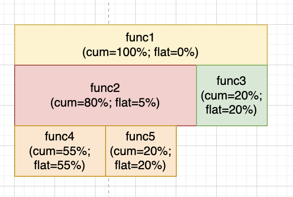
>
> Давай разберёмся:
>
> 1. `func1` — встречается в 100% сэмплов. Её `flat=0%`, значит она ничего не делала, кроме как вызывала `func2` и `func3`.
> 2. `func2` — встречается в 80% сэмплов, но её `flat=5%` — столько она делала свою работу. 75% времени (`cum - flat = 80 - 5 = 75%`) она ждала `func4` и `func5`, поэтому сумма их `cum = 75%` (`55% + 20%`).
> 3. `func4`, `func5` имеют `cum = flat`, потому что никого не вызывают и делают только свою работу. Поэтому `func2` дольше всего ждала именно `func4`. Таким образом, в цепочке вызовов:
>
> ```
> func1
>   -> func2
>       -> func4
>       -> func5
>   -> func3
> ```
>
> тормозит больше всего именно `func4`, и в паре с `func5` вызывает «тормоза» `func2`, ибо в остальном она шустрая. Из-за тормозных `func4` и `func5` функция `func2` затормаживает и `func1`, но и `func3` кажется, могла бы быть пошустрее.
>
> **Вывод:** оптимизируем `func4`, `func5` в первую очередь, и если нужно ещё ускорение — думаем, что можем сделать с `func3`.
>
> Можно зафиксировать **готовый алгоритм чтения Flame Graph**:
>
> 1. Находим функции, где `cum = flat` — это реальные потребители CPU.
> 2. Сортируем по `flat` по убыванию — это приоритет оптимизации.
> 3. Смотрим на родителей — понимаем, кто «страдает» из-за медленных детей.
> 4. Функции с большим `cum`, но маленьким `flat` — просто «транзитные», сами по себе не виноваты.

Вернёмся к нашим кейсам.

> Одни из ключевых **«колбасок»**, на которые надо смотреть в реальном pprof:
>
> - `runtime.runqputslow` — появилась колбаска, да ещё и широкая → LRQ переполняется, выселение в GRQ.
> - `runtime.findrunnable` — широкая колбаска при высокой нагрузке → P голодают.
> - `runtime.gcAssistAlloc` — горутины помогают GC вместо полезной работы.
> - `runtime.lock` рядом с `runtime.schedule` — высокая конкуренция на глобальном mutex планировщика.
> - `runtime.notesleep` / `runtime.stopm` — широкие колбаски → не деградация, просто мало нагрузки.

------

**Кейс 1**

> Раскидал вызовы и их порядок хаотично — они могут отличаться от реальных, так как цель показать распределение вызовов и то, на какие колбаски надо обратить внимание, если они вдруг увеличились.

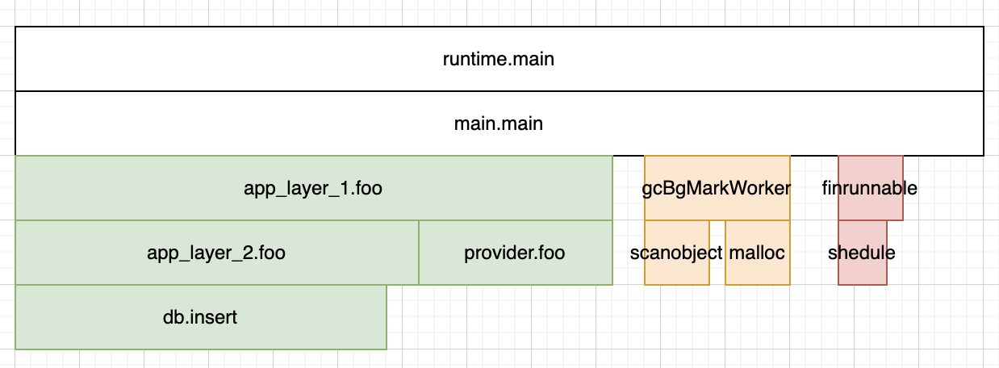

------

**Кейс 2**

> Раскидал вызовы и их порядок хаотично — они могут отличаться от реальных, так как цель показать распределение вызовов и то, на какие колбаски надо обратить внимание, если они вдруг увеличились.

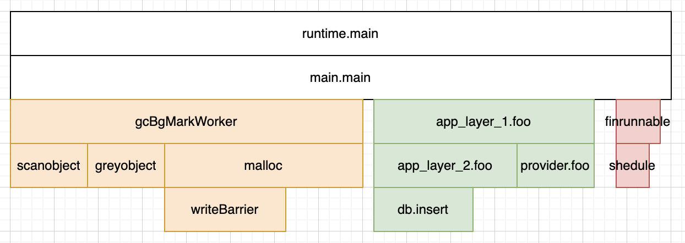

1. `runtime.gcBgMarkWorker` — GC вытесняет G, так как куча растёт быстрее, чем он успевает удалять объекты.
2. `runtime.greyobject` — GC маркирует объекты по цветам.
3. `runtime.scanobject` — сканирование живых узлов.
4. `runtime.malloc` (возможно, называется иначе — разберёмся потом) — аллокация больших блоков памяти.
5. `runtime.writeBarrier` — маркировка указателей внутри твоего кода: например `(a -> указатель) var p = a` → `runtime.writeBarrier`.

------

**Кейс 3 и Кейс 4**

> Раскидал вызовы и их порядок хаотично — они могут отличаться от реальных, так как цель показать распределение вызовов и то, на какие колбаски надо обратить внимание, если они вдруг увеличились.

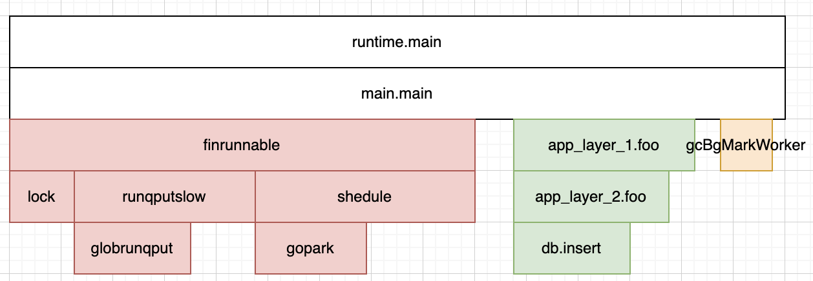

1. `runtime.gopark` — горутины «уходят спать» немедленно после пробуждения.
2. `runtime.globrunqput` — во время парковки горутины утекают в GRQ.
3. `runtime.runqputslow` — переполнение LRQ у P вынуждает вытеснять 128 G в GRQ.
4. `runtime.findrunnable` — часто M уходят в режим поиска новых G для работы.
5. `runtime.schedule` — часто запускается планировщик.
6. `runtime.lock` — часто планировщики на ядрах упираются (взаимно блокируются) в глобальном мьютексе.

------

**Кейс 5**

> Раскидал вызовы и их порядок хаотично — они могут отличаться от реальных, так как цель показать распределение вызовов и то, на какие колбаски надо обратить внимание, если они вдруг увеличились.

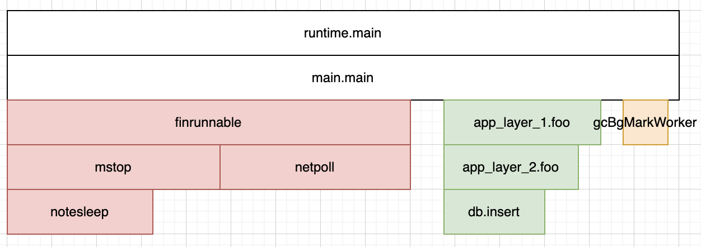

1. `runtime.findrunnable` — часто M уходят в режим поиска новых G для работы.
2. `runtime.stopm` + `runtime.notesleep` — M сами себя замораживают при отсутствии работы syscall'ом `futex`.
3. `runtime.netpoll` — планировщик очень часто опрашивает поллер вхолостую, много горутин ждут сети, мало реально работают.

------

Подводя итоги, хочу порекомендовать эти статьи (да, они старые, но на мой взгляд достаточно наглядны):

- https://www.matoski.com/article/golang-profiling-flamegraphs/
- https://brendanjryan.com/2018/02/28/profiling-go-applications.html


------

## GC и снова магия рантайма Go!

*Предисловие:* вкратце вспомним про P (process), G (goroutine), M (machine). P — это планировщик, у которого есть очередь G, то есть горутин. Именно он «запускает» G и принимает решение о том, что пора бы другой G из очереди поработать. M — это поток Linux, на который монтируется один из P. И да, снова это очередные структуры, размещённые в куче :)

Прежде чем понять, как именно работает GC, давай разберёмся, как происходит **«остановка мира»**, необходимая для того, чтобы GC смог безопасно очистить кучу.

------

### Остановка мира (STW — stop the world)

Есть такая прекрасная функция в рантайме Go — **runtime.stopTheWorldWithSema**. Первое, что она делает — это в глобальном для рантайма объекте **schedt** ставится флаг **gcwaiting = 1 (atomic.Uint32)**, который «сигнализирует миру» о том, что кто-то хочет **«остановить мир»** (зачем нужен `schedt`, разберёмся потом, сейчас нам просто надо знать, что он есть)! Далее функция перебирает глобальный для рантайма массив всех P — **[]allp**, защищённый глобальным для рантайма мьютексом **allpLock (rwmutex)**. Напомню, что в один момент времени у каждого P может быть только одна активная G и есть один M, на котором эта G исполняется. Так вот, `runtime.stopTheWorldWithSema` у каждой активной G каждого P меняет значение поля **stackguard0** на значение **stackPreempt**. Делает она это, вызывая **runtime.preemptall**, внутри которой цикл, который как раз итерируется по `[]allp` и для каждого P использует вызов функции **runtime.preemptone**.

#### Cooperative preemption и STW

А теперь вспоминаем про инструкцию, которая есть в прологе любой функции:

```assembly
# -> func myCoolFunc() — пролог
0000000000100001 <my_cool_package.myCoolFunc>:
    cmp  0x10(%r14), %rsp    # g.stackguard0 == stackPreempt ?
    jbe  0x100050            # да, прыгай в 0x100050
    ...etc
    callq <runtime.morestack_noctxt.abi0>  # <--- 0x100050
```

Ага, это оно :) Значение **stackPreempt** вынудит прыгнуть в **runtime.morestack**, ибо «функции будет казаться», что её стек закончился и его надо увеличить. Но как это связано с `runtime.stopTheWorldWithSema`? Отвечаю: прямо никак, так как установка `stackguard0 = stackPreempt` и проверка границ стека происходят параллельно. И если говорить честно — `runtime.stopTheWorldWithSema` **намеренно «портит» стек активных горутин** у каждого P, запущенного на M. Зачем? Давай разбираться дальше.

`runtime.morestack` сохранит регистры **RSP, RBP, RIP** текущей активной G (у каждой G есть поле типа **gobuf**, которое хранит состояние регистров), чтобы потом восстановиться с того же места, на котором произошла остановка. Причём сохраняются только эти регистры, а остальные же регистры (AX, BX, CX, SI, DI, R8–R15 и т.д.) обязана вызванная функция самостоятельно сохранить к себе на стек-фрейм.

> *P.S. Интересный факт — `runtime.morestack` существует только в виде ASSEMBLY.*

```assembly
0000000000100001 <my_cool_package.myCoolFunc>:
/* --> 0x100002 */  cmp  0x10(%r14), %rsp  # g.stackguard0 == stackPreempt ? [пролог]
                    jbe  0x100050          # да, прыгай в 0x100050
                    ...etc
                    retq
/* --> 0x100050 */  movq %rax, 0xa0(%rsp)  # myCoolFunc на свой стек-фрейм сохраняет RAX
                    movq %rbx, 0xa8(%rsp)  # myCoolFunc на свой стек-фрейм сохраняет RBX
                    callq <runtime.morestack_noctxt.abi0>
                    # morestack использует RAX, RBX под свои нужды, поэтому
                    # необходимо их восстановить из стек-фрейма
                    movq 0xa0(%rsp), %rax  # восстанавливаем из стек-фрейма RAX
                    movq 0xa8(%rsp), %rbx  # восстанавливаем из стек-фрейма RBX
                    jmp  0x100002          # прыгаем вновь в пролог myCoolFunc
```

Теперь важное уточнение — у каждого M есть два поля (указатели на G):

1. **g0 (g)** — это буквально g (горутина), работающая на стеке потока Linux
2. **curg (g)** — это пользовательская g (горутина), полученная из P

Так вот, `runtime.morestack` проверяет не только границы стека `curg` и сохраняет регистры `curg`, но и перед каждым увеличением стека заставляет прыгнуть M (поток Linux) со стека `curg` (стек `curg` напомню «монтируется» в анонимной памяти через системный вызов `mmap`) на стек системный, то есть **на стек потока Linux**, и теперь M буквально будет «выполнять» `g0` :) Зачем нам это? А вот зачем: при остановке мира или при расширении стека `curg`, `runtime.morestack` всегда вызывает **runtime.newstack**. `runtime.newstack` обнаружит у `curg` `stackguard0` в значении `stackPreempt`, и это вынудит его перейти к «парковке» `curg`.

**Парковка** — состояние ожидания, при котором G не занимает M и не стоит в очереди планировщика. А парковка или просто же штатное увеличение стека — это переход в рантайм. И так как «это абстрактное понятие», то требуется продолжить выполнение функций рантайма на стеке, который не относится к стеку пользовательского кода — для этого и нужен прыжок на `g0`. Далее будет сложная цепочка вызовов, каждую из которых не вижу смысла разбирать по отдельности, и скажу лишь одно — только здесь, в этой цепочке, нам наконец-то понадобился **schedt.gcwaiting == 1**, «наличие» которого станет фактором **заморозки M** (потока Linux)! Цепочка вызовов:

```
runtime.preemptPark
  -> runtime.dropg
      -> runtime.schedule
          -> runtime.findRunnable
              -> runtime.gcstopm
                  -> runtime.stopm
                      -> runtime.mPark
                          -> runtime.notesleep
                              -> runtime.futexsleep
                                  -> syscall futex
```

В результате цепочки:

1. Ранее активная G:
   1. отцеплена от M. Нет потока — значит и выполняться не на чем.
   2. отцеплена от P и не лежит в его очереди. Некому её запустить на M.
   3. не лежит в gQueue (глобальная очередь G, которые не поместились в очереди существующих P).
   4. получила статус **_Gpreempted** — горутина не знала, что её остановят, и для запуска нужно восстановить регистры.
   5. лежит только в списке всех существующих G — **[]allgs**.
2. P, на котором ранее была смонтирована G:
   1. отцеплен от M.
   2. получил статус **_Pgcstop** — то есть остановлен GC.
3. M, на котором ранее была смонтирована G:
   1. Поместил себя в уже известный нам `schedt` как M который спит — **midle**.
   2. Сам себя замораживает системным вызовом Linux — **futex**.

Вся эта пляска с бубном называется — **cooperative preemption!** И если упростить — фактически рантайм Go намеренно вводит активную G в заблуждение насчёт того, что у неё закончился стек, что приводит в итоге к проверке флага запуска GC и к заморозке всего потока Linux. Звучит как костыль галактических масштабов, но это так, оно работает и очень даже успешно. А ты теперь живи с этим :)

#### Async preemption и STW

Но это не всё! Ещё `runtime.stopTheWorldWithSema` инициирует **async preemption**! А что если горутина сейчас в бесконечном цикле? Как быть? Она гарантированно точно не пойдёт проверять границу своего стека :) И на это есть решение, которое называется — **async preemption!** Оно выполняется в **2 шага**.

На самом деле `runtime.stopTheWorldWithSema` после «порчи» стека активных горутин ещё и посылает сигнал Linux — **SIGURG** каждому M. Мы уже знакомы с **runtime.preemptone**, внутри которой для каждого M, взятого из P (при итерации по `[]allp` в `runtime.preemptall`), есть вызов функции, которая написана для каждой ОС отдельно — **runtime.preemptM**. Именно `runtime.preemptM` вызывает системный вызов на отправку сигнала SIGURG (через вызов **runtime.signalM** выполняется системный вызов Linux **tgkill**). Вспомним немного про то, как сигналы обрабатываются потоками Linux:

1. **(Кейс 1)** Если поток спит, но выполнялся ранее на том же ядре, на котором сейчас выполняется Linux: Linux пишет в `task_struct` сигнал, и если Linux принял решение, что именно этот поток должен сейчас занять ядро CPU, то Linux намеренно RIP ставит на обработчик прерываний в «коде потока», а не на последнюю инструкцию, выполненную перед выселением с ядра CPU. То есть выбора у потока просто нет — он будет обрабатывать сигнал, хочет он того или нет :)
2. **(Кейс 2)** Если поток выполняется (или же спит) не на том же ядре, где сейчас выполняется Linux: Linux генерирует межпроцессорное прерывание, и на том ядре, на котором выполняется сейчас поток, само ядро CPU выселяет поток и запускает Linux. Дальше всё то же самое, как в кейсе 1: запись в `task_struct`; если поток надо поселить на ядро CPU — замена RIP.

Когда процесс стартует, Linux из ELF-файла берёт адрес обработчика, и в Go это ASSEMBLY функция — **runtime.sigtramp**. Когда Linux остановил поток из-за сигнала, то он все регистры сохранил в структуре **ucontext_t** (это C-структура), которая лежит в стеке потока в специальном фрейме стека (Signal Frame) и содержит значения регистров `RIP`, `RSP`, `RFLAGS`, `RAX-R15` и т.д. на момент прерывания. Также у каждого потока в Linux есть постоянный участок памяти, который доступен только ему — **TLS**, про который мы уже знаем — **runtime.getg**.

Вернёмся к async preemption.

**Шаг 1:** обработать сигнал; вернуть управление Linux для восстановления регистров; получить обратно управление и начать исполнять последнюю прерванную G. Шаг 1 — это цепочка вызовов, объяснять каждый вызов из которой не вижу смысла:

```
runtime.sigtramp
  -> runtime.sigtrampgo
      // в TLS записывается специальная G — g.m.gsignal для обработки сигналов Linux
      -> runtime.sighandler      (использует getg(), поэтому в TLS записана gsignal)
          -> runtime.doSigPreempt (использует getg(), поэтому в TLS записана gsignal)
              -> runtime.pushCall (использует getg(), поэтому в TLS записана gsignal)
      // перед выходом в TLS сохраняем остановленную G
syscall rt_sigreturn
```

> *P.S. Системный вызов `rt_sigreturn` завершает обработку сигнала (тут есть хитрость в том, что вызов делает ядро Linux, но не будем закапываться вглубь).*
>
> *P.S.S. То есть `gsignal` (это тоже структура G, а точнее `\*g`) — это просто специальный, изолированный стек (физически живёт в анонимной памяти — mmap), куда рантайм переключается на время обработки сигнала, чтобы не трогать:*
>
> 1. *`m.curg` (тоже `\*g`) — стек пользовательской горутины (физически живёт в анонимной памяти — mmap)*
> 2. *`m.g0` (тоже `\*g`) — стек рантайма, на который переключается M если `curg` вызвала функцию рантайма (физически живёт в стеке потока)*

В итоге в `ucontext_t` регистры `RIP`, `RSP` будут смотреть в **runtime.asyncPreempt**, а **Linux из `ucontext_t` восстановит значение всех остальных регистров CPU** (`RAX`, `RBX`, `RCX`, `XMM0`, и т.д.). Как только Linux отдаст управление потоку после обработки системного вызова **rt_sigreturn**, то M стартанет с `runtime.asyncPreempt`. Но почему? А потому что `runtime.pushCall` сдвинул `RIP`, `RSP` так, будто G сама выполнила инструкцию **callq <runtime.asyncPreempt>**:

```assembly
# пускай у G в момент прерывания выполнялась инструкция movl:
0000000000100001 <my_cool_package.myCoolFunc>:
    ...etc
    movl $0x7, %eax  # <---- [сюда смотрел RIP]

# ---- после runtime.pushCall у G будет имитация callq asyncPreempt ----
# Вспомним что делает callq:
# 1. push RIP — сохраняет адрес куда нужно вернуться (RETURN ADDR),
#              уменьшает RSP на 8 байт, получая адрес первой инструкции
#              вызываемой функции
# 2. jmp — прыгает в первую инструкцию вызываемой функции

0000000000100001 <my_cool_package.myCoolFunc>:
    ...etc
    movl $0x7, %eax  # <---- [сюда теперь смотрит RETURN ADDR в стеке прерванной G]
    # вот что делает runtime.pushCall:
    # 1. в стек G сохраняет RETURN ADDR на адрес `movl $0x7, %eax`
    # 2. RIP сдвигает в asyncPreempt

0000000000200001 <runtime.asyncPreempt>:
    # <---- [сюда теперь смотрит RIP]
```

В итоге **Шага 1**:

1. Linux восстановил состояние всех регистров G до прерывания.
2. В TLS записан адрес прерванной G.
3. Обработчик прерываний рантайма Go имитировал вызов `runtime.asyncPreempt` так, будто сама G её вызвала, а в стеке G записал RETURN ADDR на адрес инструкции, которая выполнялась последней до прерывания Linux'ом потока, на котором исполнялась G.

**Шаг 2:** `runtime.asyncPreempt` сохраняет регистры (AX, BX, CX, SI, DI, R8–R15 и т.д.) на стек G. Далее **runtime.asyncPreempt2**, которая по сути является обёрткой вокруг вызова **runtime.mcall**. `runtime.mcall` важна, так как именно она выполнит прыжок на `g0` (стек потока) и именно она сохранит регистры **RSP, RBP, RIP** текущей активной G (в `gobuf`), как это бы делала `runtime.morestack`. А дальше запускается уже знакомая нам цепочка и уже известный нам результат:

```
runtime.preemptPark
  -> runtime.dropg
      -> runtime.schedule
          -> runtime.findRunnable
              -> runtime.gcstopm
                  -> runtime.stopm
                      -> runtime.mPark
                          -> runtime.notesleep
                              -> runtime.futexsleep
                                  -> syscall futex
```

Шикарно, мир уснул! **GC — в бой!**

Пруфы:

1. https://github.com/golang/go/blob/master/src/runtime/proc.go#L1663 — `runtime.stopTheWorldWithSema` ставит `gcwaiting = 1` и гадит в «стеке» активных G — `stackguard0 == stackPreempt`
2. https://github.com/golang/go/blob/master/src/runtime/asm_amd64.s#L638 — сохранение регистров активной `curg` в `runtime.morestack` / переход с `curg` на `g0` / вызов `newstack`
3. https://github.com/golang/go/blob/master/src/runtime/stack.go#L1093 — проверка `stackPreempt` и переход к «парковке»
4. https://github.com/golang/go/blob/master/src/runtime/proc.go#L4404 — парковка G со сменой её статуса и отцеплением от M
5. https://github.com/golang/go/blob/master/src/runtime/proc.go#L4443 — проверка `gcwaiting = 1` / засыпание M

------

## Примитивы синхронизации sync, atomic

Тут важно вспомнить про **Когерентность Кэша** по протоколу MESI. У каждого ядра есть своя копия кэш-линии. Если у какого-нибудь ядра Core1 кэш-линия находится в статусе E *(exclusive — полностью эквивалентна RAM)* или M *(modified — не эквивалентна RAM и требует commit'а, то есть сброса в RAM)*, то оно сразу может выполнять изменения, не отправляя RFO-запрос на шину *(запрос — я хочу быть уникальным владельцем и изменять линию как хочу)*. Остальные ядра Core2, Core3 имеют копию в состоянии I *(invalid — требует загрузки с RAM)*, так как ранее получили от ядра Core1 запрос RFO, поэтому только Core2, Core3 могут отправить RFO-запрос. Если у ядра Core1 линия в статусе M, то Core1 при получении RFO-запроса от Core2 обязано сбросить линию в RAM, а если в статусе E — то обязано отдать статус E ядру Core2, отправившему RFO, а свою копию сделать I (invalid). Статус S *(shared — у всех копия эквивалентна RAM, но никто не изъявил желания линию изменить)* тоже позволяет отправить Core1 запрос RFO, тогда Core2, Core3 поставят статус своим линиям I (invalid).

Так вот. Всё это невозможно на x86-64 + Linux без **CAS** и **SPINLOOP**. CAS — инструкция `LOCK CMPXCHG`, которая буквально проверяет: у ядра линия в статусе E или M? SPINLOOP — это цикл из двух инструкций:

1. **LOCK CMPXCHG** — или же CAS, проверка того, что линия у ядра, выполняющего LOCK, в статусе E или M.
2. **PAUSE** — заставляет ядро просто ждать ~100 тактов, ничего не делая, что позволяет ядру, у которого линия в статусе E или M, спокойно поработать, а не реагировать на каждый RFO-запрос.

Когерентность кэша в Go используется в **sync.Mutex** и в **runtime mutex'ах** (вспоминаем про `allpLock (rwmutex)`; `schedt.lock (mutex)`) и называется **Fast Path**. Fast Path реализуется самим Go, то есть SPINLOOP — это буквально цикл в исходниках Go. SPINLOOP ограничен попытками CAS. Если попытки CAS исчерпаны, то используется **Slow Path**: выполняется системный вызов Linux — **futex**. `futex` — это системный вызов, который заставляет весь поток Linux заснуть на некоторое время.

### А теперь подробней про sync.Mutex и sync.RWMutex

*(раздел в разработке)*

------


# Паттерны/Подходы/Практики и т.д.

## Worker Pool - в GO это троттлер, а не космолет!

Если ты жадный до того чтобы написать очередной космолет, то Worker Poll это идеальная среда для того чтобы убить весь смысл GO :) Забегая вперед, Worker Poll'ы в GO существуют с одной целью - ограничить кол-во горутин, потому что на то есть весомые причины. Я еще не знаю, будет ли это самый большой по объему раздел, но забегая вперед могу сказать очень важную вещь: 

> Worker Pool самая противоречивая вещь в GO, так его неуместное использование будет настоящим ред флагом, который подсветит тебе проблему с архитектурой твоего приложения и подсветит тебе то, что пора бы залезть в кишки go и позапускать там Benchmark'и и, чтобы очередной раз убедиться в том что - надо доверять рантайму, так те кто его создавали съели не одну собаку! **Запомни: появилось жгучее желание добавить Worker Pool - бей себя по руками и копай в другую сторону!**

Давай посмотрим какие же причины могут быть чтобы Worker Poll появился в твоем приложении:

**База данных.**

Почти каждая БД имеет настройку `max_connections`. От СУБД к СУБД имя настройки может отличаться, но смысл везде один и тот же - нельзя создавать больше коннекшенов чем в этой настройке. Каждое соединение это:

1) Высокое потребление памяти - большенство СУБД написаны на C/C++ (тот же PgSQL) у которых, каждое новое соединение это новый поток ОС, далее по тексту будем их называть боевыми конями :)
2) Конкуренция до диска (P.S. и еще disk trashing о котором мы еще поговорим) - 10000 боевых коней просто будут упираться в ОС которая будет в один момент времени лишь одному обращаться к диску
3) Больше обращений к примитвам синхронизации - 10000 боевых коней просто будут упираются в уже нам известный CAS + SPINLOOP

Если твое приложение деплоится в 10 подов kuber'а, то все они, дружно, в сумме, должны захватить не более `max_connections` соединений, а если у тебя еще и canary deploy... Ну что нарисовал себе картинку Worker Poll?

**CPU Bound задачи.**

Задачи, которые буквально делают CPU=21% -> CPU=148% :) Им вообще нежелательно выражаться в сотнях/тысячах горутин. По %CPU ты уже понял, что это задачи которые что-то очень много делают, активно давят на CPU своими инструкциям, не давая ему продоху. Такие задачи возникают не потому что код написан плохо - рекурсивно просматривает каждый байт файла размером в 1 ГБ :))). Это задачи которые сами по себе такие, так как работают над большим объемом данных, который на горизонте планирования будет становиться только больше:

1) Обработка изображений: ресайз; наложение фильтров; конвертация из PNG в WebP; ...
2) Транскодирование аудио/видео
3) И т.д. что там бизнес придумает...

Если ты пульнешь 10000 боевых коней, которые должны транскодировать каждый по часову видосу, то эти твои боевые кони больше времени проведут в статус _Grunnable :) sysmon как минимум не позволит каждой из них поработать больше 10 ms. А раз они длиный, и каждые 10 ms убегают в LRQ, то не забывай про то что у тебя еще есть другие боевые кони, которые принимают сетевые запросы. Так у тебя просто будет расти кол-во горутин и возникнет сиутация про которую мы уже говорили в Мониторинг модели P,M,G -> полная деградация планировщика -> тлен -> смерть :) 

**API Rate Limit.** 

Представь, есть сервис, который не может обработать более 10 RPS? Но тебе надо выполнять 50 RPS к нему... Вот не задача... Что же делать? Думаю ты уже знаешь ответ :)

---

**Итого**: Worker Pool в Go — это **троттлер "ресурса"**, а не умный планировщик горутин. Размер пула диктует ограничение "ресурса", а не "я так чувствую". А теперь давай проверим это. Пускай у нас CPU Bound задача высосанная из пальца:

```go 
const sliceSize = 100_000

// указатель здесь нужен потому что
// в следующих тестах мы задействует sync.Pool :)
func fillSlice(s *[]float64) {
	var val float64
	for i := 0; i < sliceSize; i++ {
		*s = append(*s, val)
		val++
	}
}

// 100_000 * 100_000 гарантировано
// дашь "прикурить ядру CPU"
func heavyTask(s []float64) float64 {
	var result float64
	for i := 0; i < len(s); i++ {
		for j := 0; j < len(s); j++ {
			result += s[i] * s[j]
		}
	}
	return result
}

func BenchmarkClearHeavyTask(b *testing.B) {
	slice := make([]float64, 0, sliceSize)
	fillSlice(&slice)

  b.ReportAllocs() // ставим счетчик аллокаций
	b.ResetTimer()	// сбрасываем все счетчики, чтобы только "замерить логику"
	
	for i := 0; i < b.N; i++ {
		heavyTask(slice)
	}
}

// Давай-ка сначала глянем на то что там сбилдил компилятор:
// > "GOOS=linux GOARCH=amd64 go test -c -o worker_pool_bin ."
// > "objdump -d worker_pool_bin > worke_pool_bin_asm"
// Ну мы уже подкованные, поэтому не будем искать fillSlice и heavyTask
// их просто не существует - inlining :)

// ...etc это наша fillSlice в теле BenchmarkClearHeavyTask
  52a7e5: callq	0x47a0c0 <runtime.makeslice> // выделяем слайс
  52a7ea: movq	%rax, 0x50(%rsp) // запоминаем длину в стеке
  52a7ef: movq	$0x0, 0x58(%rsp) // это наш val == 0 в стеке
  52a7f8: movq	$0x186a0, 0x60(%rsp)    # imm = 0x186A0 // сохраним в стек длину
  52a801: xorl	%eax, %eax
  52a803: xorps	%xmm0, %xmm0
  52a806: jmp	0x52a822 <examples/worker_pool.BenchmarkClearHeavyTask+0x62>
  52a808: movq	%rbx, 0x58(%rsp) // берем адрес текущего i-ого
  52a80d: movsd	%xmm0, -0x8(%rdx,%rbx,8) // сдвигаем на 8 байт от адреса i, 
																				 // чтобы получить адрес следующего i
																				 // для s[i] = val 
  52a813: movsd	0x90ced(%rip), %xmm1  // контанта float64 == 1 по адресу (вероятней всего :)
  52a81b: addsd	%xmm1, %xmm0 // val = val + 1, шаг ранее xmm0 мы получили аддрес i-ого элемента
  52a81f: incq	%rax // i++
  52a822: cmpq	$0x186a0, %rax          # imm = 0x186A0 // Если i >= 100 000, выходим из цикла
																												// ранее 0x186a0 в стек по этому адресу
																												// записали длину
  52a828: jge	0x52a87f // прыжок из цикла дальше
	52a82a: movq	0x60(%rsp), %rcx // из стека вытягиваем cap
  52a82f: movq	0x58(%rsp), %rbx // сохраняем на стек адрес текущего i
  52a834: incq	%rbx
  52a837: movq	0x50(%rsp), %rdx
  52a83c: nopl	(%rax)
  52a840: cmpq	%rbx, %rcx // контроль от выстрела себе в ногу i < cap? иначе иди увеличивай слайс
  52a843: jae	0x52a808 // прыгаем к 52a808 то есть на следующую итерацию цикла
// ...etc
// ...etc это наша heavyTask которая просто находится внутри цикла b.N  
// --- НАЧАЛО ЦИКЛА b.N (Benchmark) ---
  52a889: 48 3b 81 c8 01 00 00  cmpq  0x1c8(%rcx), %rax    # i < b.N ?
  52a890: 7e 09                 jle   52a8b2               # Если i >= b.N, выходим из бенчмарка (ret)
// --- ИНИЦИАЛИЗАЦИЯ heavyTask ---
  52a8a9: movq  0x58(%rsp), %rdx // Загрузить len(s) в %rdx (100,000)
  52a8ae: xorl  %ebx, %ebx // i = 0 (внешний цикл heavyTask)
  52a8b0: jmp   52a8c0 // Прыжок к проверке условия внешнего цикла
// --- ВНЕШНИЙ ЦИКЛ (по i) ---
  52a8b8: incq  %rbx // i++
  52a8c0: cmpq  %rdx, %rbx // i < len(s) ?
  52a8c3: jge   52a899 //Если i >= len, идем на следующую итерацию b.N (inc %rax)
// --- ВНУТРЕННИЙ ЦИКЛ (по j) ---
  52a8c5: xorl  %esi, %esi // j = 0
  52a8c7: jmp   52a8cc // Прыжок к проверке условия внутреннего цикла
  52a8c9: incq  %rsi // j++ (ВОТ ОНО! Все, что осталось от j++)
  52a8cc: cmpq  %rdx, %rsi //  j < len(s) ?
  52a8cf: jl    52a8c9 // ЕСЛИ j < len, ПРЫЖОК НАЗАД на 52a8c9 (крутим j)
// --- ЗАВЕРШЕНИЕ ВНУТРЕННЕГО ЦИКЛА ---
  52a8d1: jmp   52a8b8 // Прыжок назад на внешний цикл (на inc %rbx)
```

Для понимания всей "нагрузки на CPU" мы полезли в ASSEMBLER :)

1) мы знаем уже про inlining - значит нет оверхеда на создание стек-фреймов :))
2) компилятор видит что слайс всегда и только всегда равен 100_000 элементам, вывод: зачем нам runtime.growslice если можно сразу писать в backing array ? :)) (P.S. но в данном случае нам пофиг, так как не fillSlice мерим)
3) компилятор видит что result никогда не используется - зачем его писать в память? Можно просто сохранить логику итерации :))

Итого получаем:
```go
// Запустим на 120 секунд
// go test -benchmem -run=^$ -bench ^BenchmarkClearHeavyTask$ -benchtime 120s
//
// P.S. да, да, assembler для Linux + x86-64, но запущен код на macos + m1.
// Однако, все твои приложения запускаются в кубере и как правило на образе
// с linux ядром и на машине скорее всего с x86-64 (Intel Xeon). 
// Давай честно, нам надо смотреть на код (asm) для той пары OS + CPU, 
// которая будет чаще встречаться в твоей практике, но для того чтобы
// сравнить "Много G" vs "Worker Pool" необязательно иметь машину Linux + x86-64 или запускать
// этот тест в докере, на маке, через кучу абстракций виртуализации :)
goos: darwin 
goarch: arm64
cpu: Apple M1
BenchmarkClearHeavyTask-8             
43        3258156481 ns/op               0 B/op          0 allocs/op
// ~3.2 секунды "чистой долбешки" на каждую итерацию :)
```

Теперь давай сравним неконтролируемый запуск горутин VS Worker Pool

```go
// Для честного сравнения heavyTask,
// будем запускать батчами
const batch = 100

func helperManyG(slice []float64, signals chan struct{}) {
	defer func() {
		signals <- struct{}{}
	}()
	// так не надо в prod делать:)
	// иначе твои боевые кони (go func) все ломятся
	// в один backing array, но здесь мы это можем опустить
	// так операции только read :)
	heavyTask(slice)
}

func helperWorkerPool(sem chan []float64, signals chan struct{}) {
	for slice := range sem {
		// так не надо в prod делать:)
		// иначе worker'ы ломятся в один backing array,
		// но здесь мы это можем опустить так операции только read :)
		heavyTask(slice)
		signals <- struct{}{}
	}
}

func BenchmarkManyG(b *testing.B) {
	slice := make([]float64, 0, sliceSize)
	fillSlice(&slice)
	signals := make(chan struct{}, batch)

	b.ResetTimer() // сбрасываем, счетчики
	b.ReportAllocs()

	for i := 0; i < b.N; i++ {
    // запускаем на каждой итерации Benchmark
    // батч задачек
		for j := 0; j < batch; j++ {
			go helperManyG(slice, signals)
		}

    // дожидаемся завершения обработки всего батча 
		for j := 0; j < batch; j++ {
			<-signals
		}
	}

  // сбрасываем, чтобы не учитывать закрытие канала
	b.StopTimer()
	close(signals)
}

func BenchmarkWorkerPool(b *testing.B) {
	slice := make([]float64, 0, sliceSize)
	fillSlice(&slice)

	maxP := runtime.GOMAXPROCS(0) // 0 - вернет кол-во, а не изменит его
  signals := make(chan struct{}, batch) // тот же смысл что и в тесте выше :)
	// ограничиваем очередь кол-вом P
  // никакого backpresure :)
  sem := make(chan []float64, maxP)

  // запускаем Worker'ов равное кол-ву P 
	for i := 0; i < maxP; i++ {
		go helperWorkerPool(sem, signals)
	}

	b.ResetTimer()
	b.ReportAllocs()

	for i := 0; i < b.N; i++ {
    // кидаем в канал задачи
		for j := 0; j < batch; j++ {
			sem <- slice // P.S. не забывай, что так как у нас нет backpresure
      						 // и нет доп. буффера, то при переполнении канала
      						 // горутина которая пытается записать в канал здесь заблокируется :)
      						 // len(sem) == 8, а batch == 100
 		}

    // дожидаемся завершения обработки всего батча
		for j := 0; j < batch; j++ {
			<-signals
		}
	}

  // сбрасываем, чтобы не учитывать закрытие канала
	b.StopTimer()
	close(sem)
	close(signals)
}
```

И так, теперь давай запустим оба теста также на 2 минуты:

```go
// go test -benchmem -run=^$ -bench ^BenchmarkManyG$ -benchtime 120s
// go test -benchmem -run=^$ -bench ^BenchmarkWorkerPool$ -benchtime 120s
goos: darwin
goarch: arm64
cpu: Apple M1
BenchmarkManyG-8               
2        60256129666 ns/op          42240 B/op        181 allocs/op
BenchmarkWorkerPool-8                  
2        61913565708 ns/op           3056 B/op          7 allocs/op
```

Теперь давай порефликсируем. В первом приблежении, что-то совсем не то, что мы хотели, не так ли? Обе реализации в итоге смогли за 2 минуты перебрать всего-то по 2 батча. Первом варианту потребовалось 60 секунд на батч из 100 задач. А вот Worker Pool тот же батч обрабатывает медленей - за 62 секунды. Но обрати внимание на то, какое давление на GC оказывает множество таких горутин. Помнишь, когда мы смотрели на модель P,M,G и на GC, мы узнали про Write Barriers, Stack Scanning и про то, что при исчерпании stack cache'а, рантайм идет в mheap чтобы занять блоки памяти именно у кучи, прежде же бежать к Linux и просить через mmap новый стек? Да, да это оно :) Чем больше горутин, тем длиннее фаза сканирования, что увеличивает время STW. А теперь представь если твое приложение не будет контролировать кол-во входных батчей? В итоге цена "мороки с Worker Pool'ом" - это не скорость выполнения задач, ибо как ты видишь никакого ускорения не получим, но задайся вопросом: какое из приложений вероятнее всего умрет по OOM ? :)). Можно было бы на этом закончить, но давай копать дальше, может еще придем к каким-нибудь выводам?

```go
// Запустим и глянем в CPU профиль:
go test -benchmem -run=^$ -bench ^BenchmarkManyG$ -benchtime 120s -cpuprofile BenchmarkManyG_cpu.out
go tool pprof -http=:8081 BenchmarkManyG_cpu.out

go test -benchmem -run=^$ -bench ^BenchmarkWorkerPool$ -benchtime 120s -cpuprofile 
BenchmarkWorkerPool_cpu.out
go tool pprof -http=:8082 BenchmarkWorkerPool_cpu.out
```

Смотрим на профили CPU для BenchmarkManyG, BenchmarkWorkerPool:

> Что-то нет, да? 
>
> 1) BenchmarkManyG - 10.5% времени heavyTask "провела в Async Preemption". А где же задыхающийся планировщик про который мы говорили ранее в "Мониторинге модели P,M,G"?  
>
> 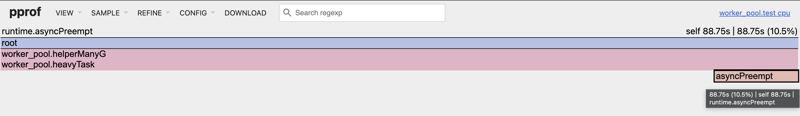
>
> 1) BenchmarkWorkerPool - 9.2% времени heavyTask "провела в Async Preemption". Почему же мы не видим разницы с BenchmarkManyG? Почему все выглядит одинаково? (мне лень делать новый скрин, в этом выбрано не CPU time а кол-во сэмлов, но сути это не меняет :)
>
> 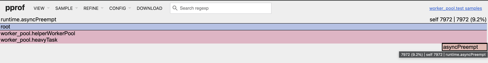

Из профиля все, что мы можешь понять, так это то, что рантайм оказывается умеет в Async Preemption, про который мы уже все знаем. Вау! Но что-то не то, правда... Может быть и нет никакой проблем в том, что в рантайме много горутин в статусе **_Grunnable**? А давай-ка узнаем как быстро работает рантайм:

1) Найди и запусти тест **BenchmarkCreateGoroutinesSingle** в runtime/proc_test.go. **~100-180 ns** - столько работает runtime.newproc о которой мы уже все знаем
2) Найди и запусти тест **BenchmarkPingPongHog** в runtime/proc_test.go. **~300-380** ns столько рантайм тратит на: парковку G; оживление G; отправку / получения сообщение в канала; планировщик. То есть столько в сумме работают все функции вместе нам уже известные: runtime.gopark, runtime.ready, runtime.schedule, runtime.chansend, runtime.chanrecv, runtime.mcall, runtime.gogo

Давай-ка воспользуемся трейсами рантайма ну или же метриками рантайма с которыми мы познакомились в "Мониторинге модели P,M,G":

```go
// Запустим и глянем в трейсы:
go test -benchmem -run=^$ -bench ^BenchmarkManyG$ -benchtime 120s -trace BenchmarkManyG.out
go tool trace BenchmarkManyG.out

go test -benchmem -run=^$ -bench ^BenchmarkWorkerPool$ -benchtime 120s -trace BenchmarkWorkerPool.out
go tool trace BenchmarkWorkerPool.out
```

Давай-ка посмотрим на трейсы во вкладке View trace by proc *(P.S. для наглядности все выводы на скринах)*

>Это BenchmarkManyG
>
>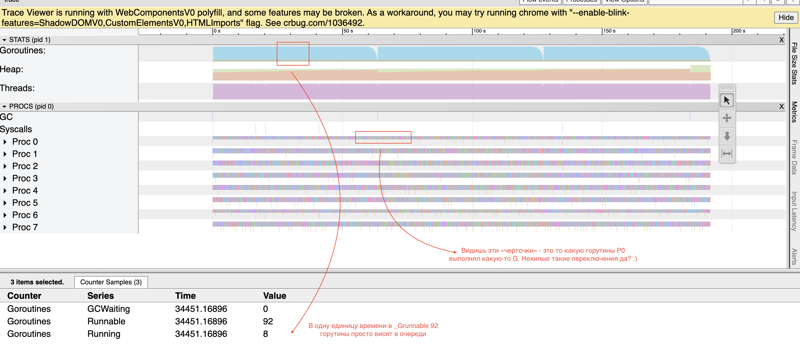
>
>Это BenchmarkWorkerPool
>
>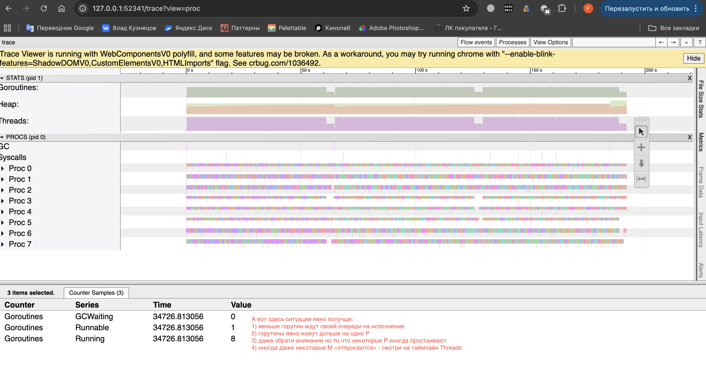

Давай-ка посмотрим на трейсы во вкладке Goroutine analysis *(P.S. для наглядности все выводы на скринах)*

> Это BenchmarkManyG
>
> 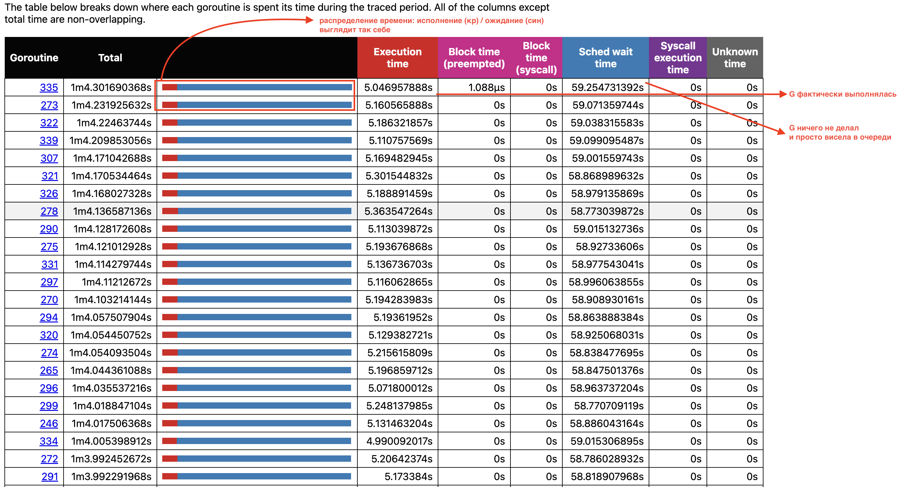
>
> Это BenchmarkWorkerPool
>
> 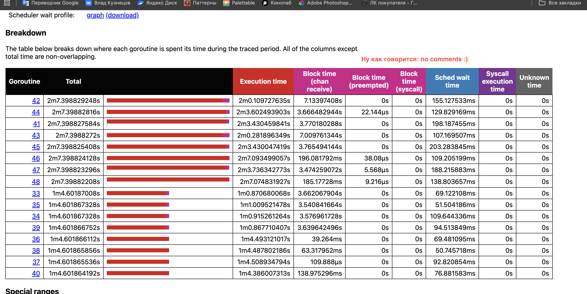

Что же теперь? Мы доказали две вещи:

1) В сценарии "Много G" - действительно много G в статусе _Grunnable, то есть тех которые ничего не делают
2) Рантайм GO умней тебя :) Разработчики GO съели не одну собаку. Как видишь он быстрый и в тестах, и даже как ты его бомбишь новыми горутинами, которые вместо полезной работы 90% времени ничего не делают. Как видишь он справляется и в итоге оба сценария примерно за одно и тоже время выполнят возложенные на них задачи.

То есть мы доказали тезис - не надо делать из Worker Pool'а "космолет", ты все равно не сделаешь лучше, чем рантайм GO.

> **Запомни: появилось жгучее желание добавить Worker Pool - бей себя по руками и копай в другую сторону!**

Теперь давай закругляться c нашим псевдо-CPUBound. Но изменим немного тесты так, чтобы имитировать "некотроолируемое" появление новых батчей: 

```go
func BenchmarkManyG(b *testing.B) {
	slice := make([]float64, 0, sliceSize)
	fillSlice(&slice)

	b.ResetTimer()
	b.ReportAllocs()

	wg := sync.WaitGroup{}
	for i := 0; i < b.N; i++ {
		for j := 0; j < batch; j++ {
			wg.Add(1)
			go func(wg *sync.WaitGroup, slice []float64) {
				defer wg.Done()
				heavyTask(slice)
			}(&wg, slice)
		}
	}

	wg.Wait()
	b.StopTimer()
}

func BenchmarkWorkerPool(b *testing.B) {
	slice := make([]float64, 0, sliceSize)
	fillSlice(&slice)

	maxP := runtime.GOMAXPROCS(0)
	sem := make(chan []float64, maxP)
	wg := sync.WaitGroup{}

	for i := 0; i < maxP; i++ {
		go func (wg *sync.WaitGroup)  {
			for slice := range sem {
				heavyTask(slice)
				wg.Done()
			}
		}(&wg)
	}

	b.ResetTimer()
	b.ReportAllocs()

	for i := 0; i < b.N; i++ {
		for j := 0; j < batch; j++ {
      wg.Add(1)
			sem <- slice
		}
	}

	wg.Wait()
	b.StopTimer()
	close(sem)
}
```

Угадай какой тест никогда не завершится, потому что:

1) либо сожрет всю память
2) либо рантайм захлебнется разгребать все твои вновь пришедшие задачи

Угадал ? Подсказка: `kill -9 <PID>` :) Так что да, в нашем псевдо-CPUBound нужен Worker Pool и ресурс, который нам надо сберечь:

1) память
2) рантайм GO 

---

Наверное ты задашься вопросом:

> *А как мне быть то? Мне критично важно выполнять эти мои CPU bound задачи и не терять их! Я могу их пихать в буферизированный канал, но рано или поздно он все равно переполнится! Что делать то?*

**Архитектура** твоего приложения - вот твой ответ. Давай придумаем вариант "на коленках".

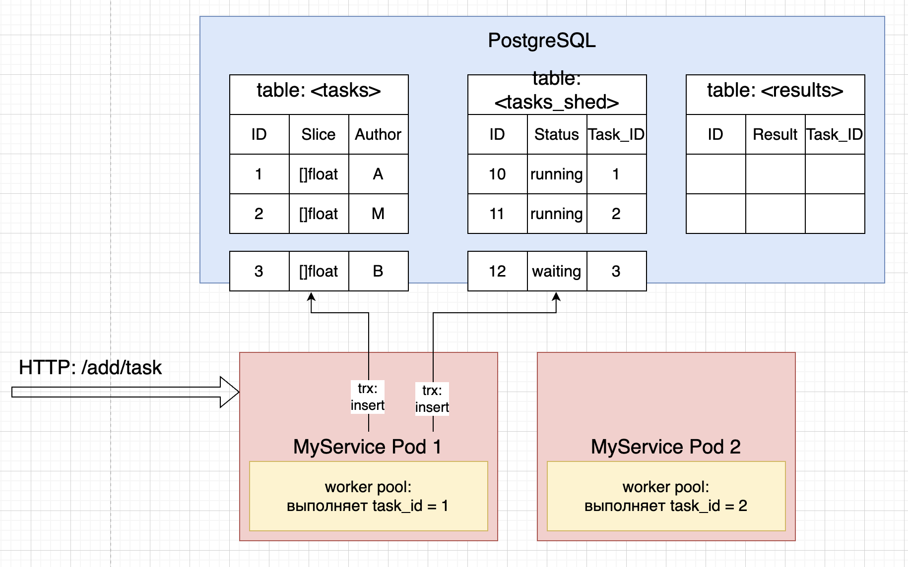

Пускай у тебя есть 2 пода твоего приложения + PostgreSQL. Есть три таблицы:

1) Задач (tasks)
2) Планировщика (tasks_sched)
3) Результата (results)

Как видишь из картинки: каждый под сейчас выполняет CPU Bound задачу в Worker Pool, при этом одновременно в Под 1 прилетел HTTP запрос на выполнение еще одной задачи. Под 1 регистрирует задачу в tasks и кладет ее в очередь планировщика tasks_sched. Но как взять задачу? Как должен работать планировщик, да еще и так чтобы не заблокировать долгой транзакций таблицу? Так как решение на коленке (к тому же автору лень код писать), давай будем считать что планировщик будет простым: 

1) если Worker Pool занят - спим

2) если Worker Pool послал планировщику сигнал что он свободен - начинаем **цикл планирования** и первым делом идем в PostgreSQL и вытягиваем задачи:

   - Если задачи есть - кидаем их в Worker Pool

   - Если задач нет - спим N-ое время и после повторяем весь цикл заново 

Очевидно что планировщик - это горутина запущенная на каждом поде. Решение в лоб, оно неидально, так у нас образуются "окна простоя", но поверь на практике оно может оказаться вполне рабочим, если "пики появления новых задач" статичны или же задач вообще редко появляются :). Именно для этого нам потребуется таблица планировщика в PostgreSQL. В ней мы не храним сами задачи, а храним статусы их выполнения, которых всего-то три:

1) waiting - ждет выполнения
2) running - выполняется
3) удалена строка - буквально ее выполнили, о ней уже ничего не знает планировщик, так как ее буквально нет в его таблице :) Но вот все остальные модули твоего приложения видят, что в таблице tasks есть какая-то задача, о ней ничего не знает планировщик, значит она должна быть уже выполнена и результат выполнения должен быть зафиксирован в таблице results. Если строки в таблице results нет - ред флаг, что-то пошло не по плану ее снова надо пихнуть планировщику в его очередь (fallback на случай аварийного завершения любого из подов)

Автору лень писать код и поэтому самое важное в твоем приложении (помимо кода CPU bound задачи) - код планировщика, который можно описать с помощью SQL :)

**Шаг 1: выборка задач**

```sql
WITH pool AS (
    SELECT id 
    FROM tasks_sched
    WHERE 
    	-- Втягиваем waiting
        status = 'waiting'
        OR 
        -- Либо вытягиваем те строки которые были заблокированы
        -- "логически" а не "физически" как при обычной транзакции.
        --
        -- advisory - логические блокировки :)
        -- Представь под 2 взял задачу, поставил ей статус running
        -- и умер :) Задача висит в running, а ее никто не исполняет.
        -- Печально да? Вот как раз здесь нам и нужны "логические"
        -- блокировки, которые просто в RAM PgSQL помечают некоторое
        -- число как занятое каким-то Connection'ом. Этим каким-то
        -- числом будет как раз ID из tasks_sched.
        -- Когда под 2 умрет, то его логические блокировки исчезнут
        -- из таблицы pg_locks. Тогда под 1 выполняя этот же SQL запрос
        -- увидит что задача running, при этом она никем "логически"
        -- не заблокирована - отлично берем!
        --
        -- ВАЖНО:
        -- У тебя мог возникнуть вопрос: а что если N-подов увидят
        -- running задачу без логической блокировки? Этого не будет
        -- дальше ты прочитаешь про FOR UPDATE - это гарантия того что
        -- у строки в один момент времени может быть один "физический владелец". 
        --
        -- ВАЖНО:
        -- PgSQL "фиолетов" на "контекст" твоего ID и если ты используешь
        -- advisory для блокировок других таблиц, то может возникнуть коллизия
        -- когда значение одно, но вот отноистся к разным таблицами.
        -- Решение: либо используй поле pg_locks.classid, но в нашем случае
        -- не выйдет так пара pg_locks.classid + твой id должны быть равни BIGINT,
        -- но вот твой ID уже BIGINT :). Посему можешь погуглить какую-нибудь
        -- хэш функцию, которая тебе склеет ID таблицы + ID строки = BIGINT.
        --
        -- ВАЖНО:
        -- Если кто-то выполняет UPDATE или DELETE, то PgSQL не проверяет
        -- наличие advisory блокировок в pg_locks. Поэтому эти операции
        -- должен делать твоей сервис, ибо он знает что надо бы проверить
        -- что строка сейчас занята кем-то (advisory), а не шальной админ, которому
        -- вдруг показалось что строку например надо "грохнуть" :)
        (status = 'running' AND id NOT IN (
            SELECT objid::int8 
            FROM pg_locks 
            WHERE locktype = 'advisory'
        ))
    ORDER BY id ASC
    LIMIT 8 -- LIMIT = GOMAXPROC
    -- Так называемая Implicit Transaction
    -- запустится транзакция, которая заблокирует
    -- возможность "захватить" выбранные строки другим подами.
    -- Потому что это физическая блоикровка как бы ты это делал
    -- используя BEGIN / COMMIT / ROLLBACK.
    -- ну и SKIP LOCKED пропускает строки заблокированные другими подами. 
    FOR UPDATE SKIP LOCKED 
)
UPDATE tasks_sched
SET 
    status = 'running', 
    updated_at = NOW()
WHERE id IN (SELECT id FROM pool)
  AND pg_try_advisory_lock(id) -- Вешаем advisory блокировку (читай выше :)
RETURNING id as sched_id, task_id as task_id;
-- Здесь закончится транзакция созданная через FOR UPDATE
```

**Шаг 2: нагрузим Worker Pool**

```sql
-- Вытягиваем контекст задач
select slice from tasks
where id in ([8]task_id)

-- Нагружаем Worker Pool
-- for task := range tasks {
-- 		workerPool.Add(task)
-- }
```

**Шаг 3: получив сигнал завершения батча задач из Worker Pool**

```sql
begin;
-- Удаляем задачи из планировщика
delete from tasks_sched where id in ([]sched_id...)
-- Снимаем advisory блокировки с Connenction'а, в котромы ты выполнял Шаг 1
select pg_advisory_unlock([8]sched_id...);
-- Фиксируем результат в таблице resluts
insert into results (result, task_id) values
(...)
;
commit;
```

Все! При желании ты можешь увеличить батч (LIMIT), но учти, что придется в Worker Pool добавить буфер! И все будет хорошо, пока не появится PgBouncer, к которому подключаются твои поды и именно от него они получают готовые, открытые Connection'ы, поэтому другой под при смерте одного пода, может унаследовать advisory, даже не зная об этом. Поэтому единственный, правильный подход в данном случае: **Heartbeat** - pg_advisory, можно сказать экзотика от автора :)

```sql
UPDATE tasks_sched
SET status = 'running',
    heartbeat = NOW() + INTERVAL '5 minutes' -- У под есть 5 минут на то чтобы, задачи завершить 
WHERE id IN (
    SELECT id FROM tasks_sched
    WHERE status = 'waiting' 
       OR (status = 'running' AND heartbeat < NOW()) -- Если другой под не завершил задачу, 
  																									 -- то он скорее всего умер 
    ORDER BY id ASC
    LIMIT 8
    FOR UPDATE SKIP LOCKED
)
RETURNING sched_id, task_id;

-- Из этого условия следует, что планировщик на поде обязан
-- раз в какое-то время обновлять heartbeat, иначе получится шалость :)
UPDATE tasks_sched SET heartbeat = NOW() + INTERVAL '5 minutes' WHERE id = <sched_id>
```

Хотел автор закончить на этом, но нет. Давай все-таки допилим наш планирощик и добавим шировещательное оповещение - **Broadcast**. В очереди PostgreSQL лезть не хочется чтобы просто отправить 1 байтовый флаг - есть работа. Нам нужно что-то что просто кинет сигнал о том, что есть новая задача. Задача подов этот сигнал принять и проверить занят ли его локальный Worker Pool или нет:

1) Если да - идем в PostgreSQL

2) Если нет - запоминаем что получили Broadcast сигнал в виде флага. Как только получаем сигнал от своего Worker Pool о том, что работа завершена, проверяем флаг:

   - Флаг пуст - спим

   - Флаг установлен - проверяем наличие новых задача в PosgreSQL и если их нет уходим спать  

Для такой задачи подойдет Redis Pub/Sub, с его концепцией «выстрелил и забыл» (**fire-and-forget**). Но вот кто должен быть инициатором? Им будет любой под который по HTTP API получил запрос для новой задачи:

```go
// Pod 1
// ------------------------------------------------------------------------------------------------------
// Получеат HTTP API запрос
func CreateTask(req *http.Request, resp *http.Response) {
  db.CreateTask(task)
  db.SchedPutTask(schedPutTask)
	defer redis.Pub(signal)
}
// ------------------------------------------------------------------------------------------------------

// Pod 2
// ------------------------------------------------------------------------------------------------------
// Worker Pool занят

// не надо так делать в prod'е :)
var workerPool *WorkerPool

func schedule(redisSig chan struct{}) {
  
  var workerPoolSleep bool
  var broadcast bool
  
  if !runTask() {
    workerPoolSleep = true
  }
  
	for {
    select {
      case <- workerPool.Sig:
        if !broadcast {
          workerPoolSleep = true
          continue
        }
      	
      	broadcast = false
        if !runTasks() {
          workerPoolSleep = true
          continue
        } 
        workerPoolSleep = false
      	
      case <- redisSig:
      	broadcast = true
      
        if workerPoolSleep && runTasks() {
          workerPoolSleep = false
          continue
        }
    }
	}
}

func runTasks() bool {
  tasks := db.GetSchedTasks()
  if len(tasks) == 0 {
  	return false
  }

  for idx := range tasks {
  	workerPool.Put(tasks[idx])
  }
  return true
}
// ------------------------------------------------------------------------------------------------------
```

Вот теперь автор доволен :) 

---

**Когда надо писать свой Worker Pool?**

Ответ: все зависит от контекста твоего приложения :). Однако, есть прекрасный Worker Pool - https://github.com/panjf2000/ants. Он умеет почти все:

1) Умеет в типизацию, чтобы не давить на GC closure'ами - помнишь что это? (анонимные функции). *(P.S. но давай честно, а ты уверен что GC станет плохо от closure'ов если ты выполняешь CPU bound задачи, которые предполагают обработку большого объема данных?)*

   ```go
   p, _ := ants.NewPoolWithFuncGeneric[*LogRaw](1000, func(raw *LogRaw) {
       write(raw)
   })
   p.Invoke(raw)
   ```

2) `ants.WithExpiryDuration` - умеет давать жить горутинам без работы, не дольше чем указанное тобой время

3) `ants.WithPanicHandler` - умеет обрабатывать панику твоей задачи, не убивая воркера (горутину)

4) встроенные `backpresure` - "обратное давление" то есть встренный оргнаичитель, которые не позволит тебе засунуть очередную задачу, заблокировав горутину которая вызвает Invoke

5) Умеет в стартегии балансировки задач

   1) Round-Robin - Пул проходит по списку воркеров один за другим. Если воркер A закончил работу, следующая задача уйдет воркеру B, затем C и так далее.
   2) Least-Recently-Used - Свободные воркеры хранятся в структуре, напоминающей **стек** (LIFO — Last In, First Out). Когда приходит задача, пул берет воркера с "вершины" — того, кто только что закончил предыдущую задачу.

---

**ВАЖНО**: автор сам надеится на то, что больше не станет "закапываться" как c Worker Pool и пробежится "голопом по Европам" по остальным паттернам :). Пускай паттерны будут разбиты на категории:

1) Хранение и работа с данными
2) Управление и оркестрация

---

## Управление и оркестрация

### errgroup

Это паттерн про управление. Представь тебе надо выполнить группу запросов к 10 разным сервисам. Тебе критически важно чтобы ответы от этих сервисов имели "положительный для тебя результат":

1) не ответили ошибкой
2) в ответе содержались нужные тебе данные

Завершив запросы, ты идешь собирать ответы "воединно" и к этому "аггрегатному" состоянию уже применяшь свою бизнес-логику. Причем, тебе важно чтобы все ответы были "положителными", иначе бизнес-логика не сможет корректно работать. Что ты будешь делать, синхронно "обходить" каждый сервис? Нет! Ты запустишь каждый запрос в отдельной горутине, применишь sync.WaitGroup и общий для всех context.Context и если хотя бы один из сервисов ответит "отрицательным" ответом, то отменишь общий context.Context, отменив запросы к другим сервисам и дальше просто отменишь всю работу, не переходя к бизнес-логике. Вот именно это и делает errgroup, который уже реализован - 

А вот авторское видение применение errgroup:
```go 

type int64OnCacheLine struct {
	state int64
	/*
		macos + m1:
			bash:> sysctl hw.cachelinesize
			bash:> 128

		int64 = 8, тогда 128 - 8 = 120
	*/
	_ [120]byte
}

type stateHandleInt64Slice struct {
	/*
		Размещаем каждый элемент слайса так, чтобы каждый
		лежал в разных кэш-линиях, чтобы не использовать
		более дорогой sync.Mutex/RWmutex
	*/
	handleBatchFlags []int64OnCacheLine
}

func GetMaxBigSliceInt64(ctx context.Context, slice []int64, sizeOfBatch ...int) (int64, error) {
	/*
		P.S. автор балуется :))
		Смотри, нам надо как-то понять сколько горутин запустить.
		Чтобы понять сколько, надо понимать какого размера батчи нужены, так?
		Давай отталкиваться оттого, что каждая горутина выгрузит
		в L-кэш кусок backing array слайса - батч.
		Было бы неплохо создать немного горутин, чтобы не давить на планировщик
		но и так чтобы чтение данных было быстрым.
		Значит неплохо бы было, чтобы батч лежал в L2: это золотая середина, так как
		это быстре чем читать из L3 и уже тем более из RAM, но L2 достаточно большой
		чтобы вместить большой батч, нежели L1.
		Мы не знаем точно на какой M (поток, а поток живет на одном из ядре CPU)
		будут размещены G. Мы лишь знаем что runtime.newproc новую G всегда заселяет
		на тот P, на которой вызвал runtime.newproc в runnext, а "прошлую" runnext
		отселяет в хвост runq этого P. Мы точно не знаем, заберет ли другой P из runq
		горутины у текущего P, но в теории G из хвоста могут оказаться на другом M.
		То есть мы можем быть уверен (не на 100%, но с самой высокой вероятностью) в том,
		что только последняя из наших G будет выполняться на текущем M.
		Ок, тогда давай считать что наш батч должен занимать 25% всего L2 кэша
		чтобы снизить риск того, что при OS Context Switch мы "смоем" чужой кэш
		или чтобы снизить риск того, что "смоют" наш кэш.
		Тогда кол-во элементов в батче должно быть таким:
			bacth_size = (L2_size * 0.25) / int64_size
		В M1 + MacOS, размер кэша:
			bash:> sysctl hw.l2cachesize
			bash:> 4194304
		тогда:
			(4_194_304 * 0.25) / 8 = 131_072
	*/
	const defaultBatchSize int = 131_072

	var batchSize = defaultBatchSize
	if len(sizeOfBatch) > 0 {
		batchSize = sizeOfBatch[0]
	}

	countBatches := len(slice) / batchSize
	if countBatches <= 1 {
		var max = slice[0]
		for idx := range slice {
			if slice[idx] > max {
				max = slice[idx]
			}
		}

		return max, nil
	}

	states := stateHandleInt64Slice{
		handleBatchFlags: make([]int64OnCacheLine, countBatches+1),
	}
	grp, gctx := errgroup.WithContext(ctx)
	// SetLimit - внутри есть семафор, канал, размер которго мы сейчас установили.
	// runtime.GOMAXPROCS(0) - с этой телегой мы уже знакомы, пояснять не надо :)
	grp.SetLimit(runtime.GOMAXPROCS(0))

	/*
		В go >= 1.23:
			for batch := range slices.Chunk(actions, batchSize) {
				...etc
			}
	*/
	var batchIdx int
	for idx := 0; idx < len(slice); idx += batchSize {
		end := idx + batchSize

		if end > len(slice) {
			end = len(slice)
		}

		batch := slice[idx:end]
		batchMaxVal := &states.handleBatchFlags[batchIdx]
		batchIdx++

		grp.Go(func() error {
			/*
				Проверяем только здесь, на тот случай если вышли за лимит runtime.GOMAXPROCS(0)
				Тогда горутины, которые еще не запустились из-за лока внутри grp.Go,
				проверят не вышли ли они за пределы ожидания пользователя
			*/
			if err := gctx.Err(); err != nil {
				return err
			}

			batchMaxVal.state = batch[0]
			for idx := range batch {
				if batch[idx] > batchMaxVal.state {
					batchMaxVal.state = batch[idx]
				}
			}

			return nil
		})
	}

	/*
		Любая из G, которая первой свалилась с ошибкой
		запишет ошибку и здесь мы ее получим.
		Но если остальные G не проверяют gctx, то будем ждать всех,
		так внутри errgroup, "поломка" любой из G,
		вызвает функцию отмены контекста gctx.
	*/
	if err := grp.Wait(); err != nil {
		return -1, err
	}

	maxSliceValue := states.handleBatchFlags[0].state
	for idx := range states.handleBatchFlags {
		if states.handleBatchFlags[idx].state > maxSliceValue {
			maxSliceValue = states.handleBatchFlags[idx].state
		}
	}

	return maxSliceValue, nil
}
```

Все кто хотел познакомиться с errgroup, свободны. А дальше все кто "на факультативе" остаются здесь :)

---

**Факультатив.** 

Тезис:

> *Оптимизируешь раньше времени - клево! Но делай это небездумно, а если "думно", то проверяй, прежде чем тащить в прод!*

```go
const sliceSize = 100_000_000

func createSlice() []int64 {
	slice := make([]int64, sliceSize)
	slice[0] = int64(math.MaxInt64)

	return slice
}

/*
goos: darwin
goarch: arm64
pkg: examples/patterns/errgroup
cpu: Apple M1
=== RUN   BenchmarkClearAlg
BenchmarkClearAlg-8
25          44_080_808 ns/op               0 B/op          0 allocs/op
*/
func BenchmarkClearAlg(b *testing.B) {
	slice := createSlice()

	b.ResetTimer()
	b.ReportAllocs()

	for i := 0; i < b.N; i++ {
		var max = slice[0]
		for idx := range slice {
			if slice[idx] > max {
				max = slice[idx]
			}
		}
	}
}

/*
goos: darwin
goarch: arm64
pkg: examples/patterns/errgroup
cpu: Apple M1
=== RUN   BenchmarkErrgroupM1Default
BenchmarkErrgroupM1Default
BenchmarkErrgroupM1Default-8          
81          15_078_669 ns/op          166715 B/op       1533 allocs/op
*/
func BenchmarkErrgroupM1Default(b *testing.B) {
	slice := createSlice()

	b.ResetTimer()
	b.ReportAllocs()

	// если ты в коде видишь idx
	// а в тестах i, знай это бред автора :)
	// которого немного раздражает idx здесь
	// так ему кажется что имя idx - относится к логике
	// а имя i - относится к "служебным именам".
	// забей, автор и его бредовые заморочки :)
	for i := 0; i < b.N; i++ {
		GetMaxBigSliceInt64(context.Background(), slice)
	}
}
```

Учет CPU L-кэша + обработка батчами в Горутинах дает ускорение в 2.9 раза :). Но выиграли ли мы? Вопрос... Смотри в куче мы размещаем backing array для:

> handleBatchFlags []int64OnCacheLine

размемером на (100_000_000 / 131_072) 763 элемента обшим весом 95,3 KiB (763 * 128) и также создаем в 763 структуры `funcval` (вспоминаем, что анонимные функции `func() error` превращаются в `funcval`), которые все размещаются в куче. А вот errgroup создаст 763 объекта `G` и тоже в куче (если из пула не возьмет конечно). Запись в нанал будет выполнена 763 раза, а мы уже знаем, что `runtime.chansend` триггерит планировщик, не говоря уже о том, что мы ему докинули работы, с которой он конечно справится (как мы уже знаем в разделе с Worker Pool), но тем не менее :).

Давай-ка запустим эту же функцию с кастомным размером батча:

```go
const sliceSize = 100_000_000

/*
goos: darwin
goarch: arm64
pkg: examples/patterns/errgroup
cpu: Apple M1
=== RUN   BenchmarkErrgroupCustom
BenchmarkErrgroupCustom
BenchmarkErrgroupCustom-8             
85          14_194_112 ns/op           23332 B/op        206 allocs/op
*/
func BenchmarkErrgroupCustom(b *testing.B) {
	slice := createSlice()

	b.ResetTimer()
	b.ReportAllocs()

	for i := 0; i < b.N; i++ {
		GetMaxBigSliceInt64(context.Background(), slice, 1_000_000)
	}
}
```

Грустно, неправда ли? Кастомный размер дает на секунду ускорение и в 7.5 раз меньше аллокаций, потому что размер `handleBatchFlags []int64OnCacheLine` не 763, а только 100 и тоже самое про `funcval` и `G`, и планировщик. Упс...

Автор перебрал эти тесты в разных сценариях:

> sliceSize = 100_000_000, customBatchSize = 1_000_000
>
> sliceSize = 10_000_000, customBatchSize = 1_000_000
>
> sliceSize = 1_000_000, customBatchSize = 500_000

И поверь тенденция стабильная, упс... Хорошо, что проверил, а то так бы sh*t налил бы в prod... Так вот суть в том, что здесь не только увелечение числа горутины сказывается, но и автор не является экспертом в процессорах, так что-то подсказывает мне, что M1 и его Prefetcher скорее всего справляется лучше, чем мы ожидаем и как следствие размещение на `25% от L2` создает только проблемы. Но может надо как-то усложнить цикл?

```go
// Давай изменим код поиска Максимума
batchMaxVal.state = batch[0]
for idx := range batch {
	tmp := math.Sqrt(float64(batch[idx]))
	tmp = math.Sin(tmp)
	if tmp > float64(batchMaxVal.state) {
		batchMaxVal.state = batch[idx]
	}
}

// Реальное ускорение получилось только в паре:
// 		sliceSize = 1_000_000, customBatchSize = 500_000
// А вот остальные комбинации sliceSize + customBatchSize
// дают крошечное ускорение, но проблема с аллокациями никуда не делась :)
//
// P.S.: если customBatchSize использовать меньше defaultBatchSize, 
// то ускорение в BenchmarkErrgroupCustom конечно же будет, но аллокаций будет еще больше. 
// А если в BenchmarkErrgroupCustom дать батч не 500_000, а 300_000, то будет быстрей
// чем с 500_000, но аллокаций больше.

/*
Результаты для пары: sliceSize = 1_000_000, customBatchSize = 500_000

  BenchmarkErrgroupM1Default
  BenchmarkErrgroupM1Default-8
        620_182 ns/op  21 allocs/op
        610_197 ns/op  21 allocs/op
        614_443 ns/op  21 allocs/op
        626_323 ns/op  21 allocs/op
        623_854 ns/op  21 allocs/op

  BenchmarkErrgroupCustom
  BenchmarkErrgroupCustom-8
        1_104_065 ns/op 9 allocs/op
        1_105_472 ns/op 9 allocs/op
        1_119_402 ns/op 9 allocs/op
        1_108_489 ns/op 9 allocs/op
        1_108_184 ns/op 9 allocs/op
*/
```

Чуешь чем пахнет? Смотри: 1_000_000 / 131_072 = ~ 7.6, GOMAXPROC = 8. 2x кратное ускорение получилось потому, что мы загрузили каждый P, а каждый P живет на своем M. **Главный вывод: хочешь скорости в GO? Загружай все P и все M соотвественно!**

*P.S.: Вот здесь мы и получаем **скорее всего** ускорение на L2 и хак действительно сработал. Но результат мы получили только после добавления операций возведения в квадрат и вычисления синус, видимо потому, что батчи дольше по времении требовались ядру M1. А на простом поиске максимум скорость Prefetcher + скорость самого алгоритма не дает выигрыша*

*P.S.S.: автору не имется, прости 🙂*
А давай все-таки проверим, проведя 3 теста, что стратегия 25% L2 работает, то есть размер батча default или же 131_072 элемента или же 1_048_576 байт:
**Тест 1:**

> 1) Пускай рамез слайса 3_289_728, тогда  3_289_728 / 131_072 = 25 батчей, а 25 / 8 ядер = 3.1 батча лежит в L2. Таким образом мы загрузим каждое L2 кажого ядра 3 батчами, но создадим минимум 25 горутин.
> 2) Пуска батч 1_000_000, то один батч весит 8_000_000 байт, то и давление на L2 = 8_000_000 байт при размере L2 =4_194_304 байт, зато создаем всего-то 3 горутин

```text
bacthSize=1_000_000,   sliceSize=3_289_728: 	2_317_151 ns/op
																							2_327_628 ns/op
  																						2_337_386 ns/op
																							2_310_040 ns/op
bacthSize=default,     sliceSize=3_289_728:  	1_646_455 ns/op 
																							1_774_749 ns/op
																							1_639_311 ns/op
																							1_647_803 ns/op
```

Вывод: Тактика 25% L2 сработала, не смотря на оверхэд планировщика, которому надо создать/спланировать 25 горутин вместо 3 горутин. Ускорение нехилое 30%. *P.S.: не забывай, это недешево, мы 25 горутинами давим на GC!*

Тест 2:
>1) Пускай рамез слайса 3_289_728, тогда  3_289_728 / 131_072 = 25 батчей, а 25 / 8 ядер = 3.1 батча лежит в L2. Таким образом мы загрузим каждое L2 кажого ядра 3 батчами, но создадим минимум 25 горутин.
>
>


---


# Справка

## Структура M

#### g0 `*g`

**Что:** горутина на стеке самого OS-потока. Физически её стек — это и есть стек потока Linux (не mmap, а обычный pthread stack).

**Когда используется:** каждый раз, когда M должен выполнить runtime-код — `schedule()`, `newstack()`, `mallocgc()`, `gcMark()` и т.д. Переключение происходит через `systemstack()` или `mcall()`:

```go
// mcall прыгает с curg на g0 и вызывает fn
func mcall(fn func(*g))

// systemstack временно переключается на g0, выполняет fn, возвращается обратно
func systemstack(fn func())
```

**Кто:** runtime повсеместно. Любой код, который не должен выполняться на пользовательском стеке.

------

#### morebuf `gobuf`

**Что:** временное хранилище `gobuf`-аргументов для `morestack`. Хранит `sp/pc/g` вызывающей функции (не `curg` целиком, а именно фрейма, который триггернул `morestack`).

**Когда используется:** исключительно внутри `morestack` / `morestack_noctxt`. Живёт очень короткое время — только пока `newstack` решает растить стек или делать preemption. После — перезаписывается.

**Кто:** только assembly-код `morestack`. Пользовательский код никогда не трогает напрямую.

------

#### divmod `uint32`

**Что:** знаменатель для операции деления/остатка на ARM, где нет аппаратной инструкции деления.

**Когда используется:** только на 32-bit ARM. На x86-64 и ARM64 не используется вообще (есть `DIV`/`UDIV`).

**Кто:** компилятор и linker (`cmd/internal/obj/arm/obj5.go`) — знают точное смещение этого поля в структуре `m`.

------

#### procid `uint64`

**Что:** ID потока для отладчиков (на Linux это `tid` из `gettid()`).

**Когда устанавливается:** в `minit()` при инициализации M через `gettid()` syscall.

**Кто:** внешние отладчики (gdb, delve) читают это поле напрямую из памяти процесса. Runtime сам почти не использует — только для трассировки и краш-дампов.

------

#### gsignal `*g`

**Что:** специальная горутина исключительно для обработки сигналов Linux. Имеет собственный изолированный стек (mmap). Не планируется планировщиком — используется только как «стек для обработки сигналов».

**Почему отдельная:** во время обработки сигнала нельзя использовать ни `curg` (в произвольном состоянии), ни `g0` (может выполнять runtime-код). Нужен гарантированно чистый стек.

**Когда используется:** в `sigtrampgo` — перед входом в `sighandler` в TLS записывается `gsignal`, после выхода восстанавливается прерванная G:

```
sigtramp → sigtrampgo:
  TLS ← gsignal    // переключаемся
  → sighandler
  → doSigPreempt
  → pushCall
  TLS ← прерванная G  // восстанавливаем
```

**Кто:** `sigtrampgo`, `sighandler`, `minit` (аллоцирует стек через `mmap`).

------

#### goSigStack `gsignalStack`

**Что:** метаданные Go-аллоцированного сигнального стека — указатель, размер, флаг «был ли установлен через `sigaltstack`».

**Когда используется:** в `minit` / `unminit` при создании и уничтожении M. `sigaltstack` syscall говорит Linux «для сигналов этого потока используй вот этот участок памяти».

**Кто:** `minit`, `unminit`, `msigrestore`.

------

#### sigmask `sigset`

**Что:** сохранённая маска сигналов потока (какие сигналы заблокированы). На Linux это `sigprocmask`.

**Когда используется:** при создании нового M — сохраняется текущая маска родителя, устанавливается нужная маска для нового потока, потом при необходимости восстанавливается.

**Кто:** `mstart`, `minit`, `unminit`, `pthread_create`-обёртки.

------

#### tls `[tlsSlots]uintptr`

**Что:** thread-local storage. На x86-64 первый элемент `tls[0]` хранит указатель на текущую `g` и записывается в сегментный регистр `FS` (или `GS`). Именно отсюда `getg()` читает текущую горутину за O(1) без блокировок.

**Когда устанавливается:** в `mstart1` / `settls` при запуске потока:

```assembly
// x86-64: записываем адрес g в FS base
MOVQ  g, tls+0(SP)
CALL  runtime·settls(SB)
```

**Кто:** `getg()` читает при каждом вызове из любого места runtime. `settls` пишет при старте M. `save_g` / `restore_g` — при переключениях контекста.

------

#### mstartfn `func()`

**Что:** функция, которую M должен выполнить при старте, до того как начнёт брать горутины из очереди.

**Когда используется:** передаётся в `newm(fn, p, id)`. Например, sysmon передаёт сюда свою основную функцию. После `mstartfn()` M уходит в обычный `schedule()` loop.

**Кто:** `mstart1` вызывает если не nil. `newm` устанавливает.

------

#### curg `*g`

**Что:** текущая пользовательская горутина, которую M исполняет прямо сейчас. Стек `curg` аллоцирован через `mmap`.

**Когда меняется:**

- `nil` → `*g` в `execute()`, когда M берёт горутину из очереди
- `*g` → `nil` в `dropg()`, когда горутина паркуется или завершается

**Кто:** планировщик (`execute`, `dropg`), `morestack`, `newstack`, `gcMark` (для сканирования стека), трассировщик, профилировщик.

------

#### caughtsig `guintptr`

**Что:** горутина, которая выполнялась в момент фатального сигнала (SIGSEGV, SIGBUS и т.д.). Используется только для краш-дампа.

**Когда устанавливается:** в `sighandler`, когда сигнал фатальный и runtime собирается напечатать stack trace и умереть.

**Кто:** `sighandler`, `crash`, `throw`.

------

#### p `puintptr`

**Что:** текущий P, прикреплённый к этому M. `nil`, если M не выполняет Go-код (заблокирован в syscall, idle, sysmon).

**Ключевой инвариант:** ненулевой `p` означает эксклюзивное владение P этим M — никто другой не может использовать этот P, пока `m.p != nil`. Исключение: `curg` в состоянии `_Gsyscall` — там планировщик может отобрать P.

**Когда меняется:**

- устанавливается в `acquirep()` / `execute()`
- обнуляется в `releasep()` перед syscall, в `stopm()`

**Кто:** планировщик повсеместно, `entersyscall` / `exitsyscall`.

------

#### nextp `puintptr`

**Что:** P, зарезервированный для этого M до его пробуждения. Устанавливается до того, как M разбужен через `futex`, чтобы после пробуждения M сразу имел P без гонки.

**Когда используется:** `startm(p)` — находит idle M, записывает P в `nextp`, будит M. M в `mstart1` читает `nextp` и устанавливает его как свой P.

**Кто:** `startm`, `mstart1`.

------

#### oldp `puintptr`

**Что:** P, который был у M до входа в blocking syscall.

**Когда используется:** при `entersyscall` сохраняется текущий P в `oldp`, P отцепляется. При `exitsyscall` M пытается вернуть именно `oldp` — это оптимизация локальности (тот же P → тот же `mcache` → меньше промахов кэша). Если `oldp` уже занят — берёт любой свободный.

**Кто:** `entersyscall`, `exitsyscallfast`, `exitsyscall`.

------

#### id `int64`

**Что:** уникальный монотонно возрастающий ID M внутри runtime (не `tid` Linux, хотя часто совпадает по смыслу). Генерируется атомарным инкрементом `sched.mnext`.

**Кто:** `newm` устанавливает. Трассировщик, профилировщик, логи используют для идентификации.

------

#### mallocing `int32`

**Что:** счётчик — M сейчас внутри `mallocgc`. Предотвращает рекурсивный вход в аллокатор и сигнализирует GC, что сканировать стек сейчас небезопасно.

**Когда:** инкрементируется в начале `mallocgc`, декрементируется в конце. Если `mallocing > 0` и случился сигнал — обработка откладывается.

**Кто:** `mallocgc`, `throw` (проверяет для диагностики).

------

#### throwing `throwType`

**Что:** enum — M сейчас в процессе паники/краша (`throwTypeNone`, `throwTypeUser`, `throwTypeRuntime`).

**Когда используется:** `throw` и `panic` устанавливают. Проверяется в `sighandler`, чтобы избежать рекурсивного краша — если уже падаем, не пытаемся обработать ещё один сигнал.

**Кто:** `throw`, `sighandler`, `gopanic`.

------

#### preemptoff `string`

**Что:** если непустая строка — preemption `curg` запрещён. Строка содержит причину (для отладки), например `"stopTheWorld"` или `"write barrier"`.

**Когда используется:** в `newstack` проверяется первым делом — если `preemptoff != ""`, то preemption игнорируется даже если `stackguard0 == stackPreempt`.

**Кто:** `stopTheWorld` устанавливает/сбрасывает. Write barrier код. Любые критические секции, где preemption опасен.

------

#### locks `int32`

**Что:** счётчик удерживаемых `runtime.lock` (внутренних мьютексов runtime, не `sync.Mutex`). Не сам мьютекс — именно счётчик.

**Инварианты пока `locks > 0`:**

- планировщик не будет делать preemption этого M
- GC не включит write barrier для этого M
- `Gosched()` запрещён

**Кто:** `lock` / `unlock` инкрементируют/декрементируют. `newstack` проверяет — если `locks > 0` и пришёл запрос preemption, это `throw` (баг в runtime).

------

#### dying `int32`

**Что:** M завершается — выполняет `mexit()`. Предотвращает повторный вход в cleanup-логику.

**Кто:** `mexit` устанавливает в 1 в начале. Проверяется в `sighandler` и других местах, которые не должны работать на умирающем M.

------

#### profilehz `int32`

**Что:** текущая частота CPU profiler для этого M (сэмплов в секунду). Синхронизируется с глобальным `cpuprof.hz`.

**Когда меняется:** `setcpuprofilerate` рассылает новое значение всем M. M проверяет при каждом `mstart` и обновляет через `setThreadCPUProfiler`.

**Кто:** CPU profiler, `mstart`.

------

#### spinning `bool`

**Что:** M активно ищет работу, но ничего не нашёл — крутится в цикле вместо немедленного засыпания. Это оптимизация: лучше подождать 100ns, чем делать `futex` syscall.

**Инвариант:** runtime старается держать не более одного spinning M на каждый занятый P. Иначе — трата CPU.

**Когда:** устанавливается в `findRunnable`, когда LRQ пуста. Сбрасывается, когда нашли работу или решили спать.

**Кто:** `findRunnable`, `startm`, `wakep`.

------

#### blocked `bool`

**Что:** M заблокирован на `note` (futex). Устанавливается непосредственно перед `notesleep` и сбрасывается после пробуждения.

**Кто:** `stopm` / `notesleep` устанавливают. Трассировщик использует для различения «M ищет работу» vs «M спит».

------

#### newSigstack `bool`

**Что:** `minit` на C-потоке вызвал `sigaltstack`. Нужно, чтобы `unminit` знал — надо ли восстанавливать старый сигнальный стек или нет.

**Кто:** пара `minit` / `unminit`.

------

#### printlock `int8`

**Что:** счётчик — M сейчас внутри `print` / `println`. Предотвращает рекурсивный вывод, если аллокатор или планировщик пытаются что-то напечатать во время краша.

**Кто:** `print`, `throw`, краш-логика.

------

#### incgo `bool`

**Что:** M выполняет cgo-вызов (C-код). Пока `incgo == true`, стек нельзя сканировать обычным способом — C не знает про Go GC.

**Когда:** устанавливается в `cgocall` перед вызовом C, сбрасывается после возврата.

**Кто:** `cgocall`, `cgocallbackg`, GC (проверяет перед сканированием стека).

------

#### isextra `bool` / isExtraInC `bool` / isExtraInSig `bool`

**Что:** флаги «extra M» — это M, созданный для обслуживания C-потока, который вызвал Go-код (через `cgo` callback). Такие M не управляются обычным планировщиком.

- `isextra` — это extra M
- `isExtraInC` — extra M без Go-фреймов на стеке (чисто C)
- `isExtraInSig` — extra M в обработчике сигнала

**Кто:** `needm` (создаёт extra M для C→Go callback), `dropm` (освобождает).

------

#### freeWait `atomic.Uint32`

**Что:** трёхсостоятельный флаг безопасности освобождения M:

- `freeMRef` — есть живые ссылки, нельзя освобождать
- `freeMStack` — стек g0 ещё используется
- `freeMWait` — всё чисто, можно освобождать

**Кто:** `mexit` устанавливает. `mheap.freeStack` ждёт, пока не станет `freeMWait`.

------

#### needextram `bool`

**Что:** этот M должен создать новый extra M перед тем, как вернуться в C-код. Нужно, чтобы всегда был запасной M для следующего C→Go callback.

**Кто:** `exitsyscall`, `cgocallbackg`.

------

#### g0StackAccurate `bool`

**Что:** границы стека `g0` известны точно (не приблизительно). На некоторых платформах при старте точный размер стека потока неизвестен и используется консервативная оценка.

**Кто:** `mstart`, `traceback`.

------

#### traceback `uint8`

**Что:** уровень traceback при крашах (`0` = нет, `1` = есть, `2` = verbose). Синхронизируется с глобальным `gotraceback()`.

**Кто:** `throw`, `sighandler`, `panic`.

------

#### allpSnapshot `[]*p`

**Что:** снимок `allp`, сделанный **после** того, как M отпустил свой P в `findRunnable`. Нужен для work stealing — нельзя читать `allp` без `allpLock`, но держать лок во время stealing дорого, поэтому берётся snapshot.

**Когда:** создаётся в `findRunnable` перед work stealing loop. Очищается после.

**Кто:** `findRunnable`, `stealWork`.

------

#### ncgocall `uint64` / ncgo `int32`

**Что:**

- `ncgocall` — всего cgo-вызовов за всё время жизни M (монотонный счётчик)
- `ncgo` — cgo-вызовов прямо сейчас (обычно 0 или 1, но может быть больше при рекурсивных callbacks)

**Кто:** `cgocall` инкрементирует оба. `cgocallbackg` инкрементирует/декрементирует `ncgo`. `runtime.NumCgoCall()` суммирует `ncgocall` по всем M.

------

#### cgoCallersUse `atomic.Uint32` / cgoCallers `*cgoCallers`

**Что:** буфер для C-стека при крашах внутри cgo. `cgoCallersUse` — spin-lock на этот буфер (0 = свободен, 1 = занят).

**Кто:** `sighandler` при крашах в cgo, `cgosymbolizer`.

------

#### park `note`

**Что:** низкоуровневый примитив сна — обёртка над `futex` (Linux) / `semaphore` (macOS) / `event` (Windows). Именно через него M засыпает в `stopm()`.

**Когда используется:** `stopm` → `notesleep(&m.park)` — M блокируется. `newm` / `startm` → `notewakeup(&m.park)` — M просыпается.

**Кто:** `stopm`, `mPark`, `startm`, `newm`.

------

#### alllink `*m`

**Что:** следующий M в глобальном односвязном списке `sched.allm` — все когда-либо созданные M.

**Когда используется:** при STW для перебора всех M. В `sighandler` для рассылки сигналов. В профилировщике. В `GODEBUG=schedtrace`.

**Кто:** `newm` добавляет в начало `allm`. `mexit` удаляет.

------

#### schedlink `muintptr`

**Что:** следующий M в списке idle M — `sched.midle`. Используется как стек (LIFO) idle M.

**Когда:** `stopm` добавляет себя в `midle`. `startm` забирает из `midle`.

**Кто:** `stopm`, `startm`, планировщик.

------

#### idleNode `listNodeManual`

**Что:** узел для другого списка idle M — `sched.idlem` (используется при изменении `GOMAXPROCS` и в некоторых путях GC).

**Кто:** `stopm`, `startm` в специфичных путях.

------

#### lockedg `guintptr`

**Что:** G, заблокированная на этом M через `LockOSThread`. Пока установлена — планировщик будет всегда запускать именно эту G на этом M.

**Когда:** `LockOSThread` устанавливает в `curg`. `UnlockOSThread` сбрасывает. `schedule` проверяет — если `lockedg != nil` и текущая G другая, M паркует себя.

**Кто:** `LockOSThread`, `UnlockOSThread`, `schedule`, `execute`.

------

#### createstack `[32]uintptr`

**Что:** стек вызовов в момент создания этого M (до 32 фреймов). Используется в `StackRecord` для профилирования — откуда был создан этот поток.

**Кто:** `newm` заполняет через `callers()`. `runtime.ThreadCreateProfile` читает.

------

#### lockedExt `uint32` / lockedInt `uint32`

**Что:** счётчики вложенности `LockOSThread`:

- `lockedExt` — пользовательские вызовы `runtime.LockOSThread()`
- `lockedInt` — внутренние вызовы `lockOSThread()` из runtime

Разделены потому что балансируются независимо: пользователь должен вызвать `UnlockOSThread` столько раз, сколько `LockOSThread`. Runtime не должен мешать этому счёту.

**Кто:** `LockOSThread` / `UnlockOSThread`, `lockOSThread` / `unlockOSThread`.

------

#### mWaitList `mWaitList`

**Что:** список M, ожидающих освобождения конкретного `runtime.lock` (внутреннего мьютекса). Реализует очередь ожидания для `runtime.lock` — не `sync.Mutex`.

**Кто:** `lock2` / `unlock2` — внутренняя реализация `runtime.lock`.

------

#### ditEnabled `bool`

**Что:** DIT (Data Independent Timing) включён на этом M. Это ARM64-фича: гарантирует, что время выполнения криптографических инструкций не зависит от данных (защита от timing attacks).

**Кто:** криптографический код, `runtime/internal/sys`.

------

#### mLockProfile `mLockProfile`

**Что:** статистика contention на `runtime.lock` для этого M — сколько времени потрачено на ожидание внутренних мьютексов runtime.

**Кто:** `lock2` / `unlock2`. `runtime.MutexProfile` агрегирует по всем M.

------

#### profStack `[]uintptr`

**Что:** переиспользуемый буфер для сбора stack trace в профилировщике (`memory profile`, `block profile`, `mutex profile`). Живёт на M, чтобы не аллоцировать при каждом сэмпле.

**Кто:** `mProf_Malloc`, `mProf_Free`, `tracebackothers`.

------

#### waitunlockf `func(*g, unsafe.Pointer) bool` / waitlock `unsafe.Pointer`

**Что:** аргументы для `park_m`, которые `gopark` не может передать через стек — в момент парковки горутина меняет стек и аргументы потерялись бы.

`waitunlockf` — функция, которую `park_m` вызовет после парковки G. Если возвращает `false` — G немедленно разбуждается обратно. Используется, например, в `chanrecv` для атомарной проверки «канал всё ещё пуст?».

`waitlock` — аргумент для `waitunlockf` (обычно указатель на канал, семафор и т.д.).

**Кто:** `gopark` устанавливает. `park_m` читает и вызывает. После использования оба сбрасываются в nil.

------

#### waitTraceSkip `int` / waitTraceBlockReason `traceBlockReason`

**Что:** метаданные для execution tracer — причина блокировки горутины и сколько фреймов пропустить при записи stack trace в трейс.

**Кто:** `gopark` устанавливает. `park_m` передаёт в трейсер.

------

#### syscalltick `uint32`

**Что:** монотонный счётчик, инкрементируемый при каждом входе в syscall. Именно его `sysmon` читает в `retake()` — если значение не изменилось с прошлой итерации sysmon, значит M застрял в syscall дольше порога (~20µs) и P надо отобрать.

**Кто:** `entersyscall` инкрементирует. `sysmon.retake` читает.

------

#### freelink `*m`

**Что:** следующий M в списке `sched.freem` — M, которые завершились, но чьи ресурсы ещё не освобождены полностью (например, g0 стек ещё используется при завершении).

**Кто:** `mexit` добавляет в `freem`. `newm` периодически очищает `freem`, освобождая ресурсы.

------

#### trace `mTraceState`

**Что:** состояние execution tracer для этого M — буферы событий, счётчики, флаги.

**Кто:** пакет `runtime/trace`. Каждое трейс-событие (goroutine start/stop, syscall, GC) пишется через этот буфер.

------

#### libcallpc / libcallsp / libcallg

**Что:** PC, SP и G в момент cgo-вызова. Хранятся **на M**, а не на стеке, потому что cgo-вызов может двигать Go-стек (stack copying) — если бы хранились на стеке, после копирования указатели стали бы невалидными.

**Кто:** CPU profiler использует для корректного traceback через cgo-границу. `cgocall` устанавливает, `cgocallbackg` сбрасывает.

------

#### winsyscall `winlibcall`

**Что:** параметры Windows syscall — хранятся на M по той же причине, что и `libcall*`: syscall может переключить стек.

**Кто:** только Windows. Пакет `syscall` на Windows.

------

#### vdsoSP / vdsoPC `uintptr`

**Что:** SP и PC для traceback внутри VDSO-вызовов. VDSO (Virtual Dynamic Shared Object) — механизм Linux для быстрых syscalls без перехода в kernel (например, `clock_gettime`). Пока M внутри VDSO — стек в специфичном состоянии, нужны отдельные SP/PC для корректного traceback.

**Кто:** `time_now` и аналогичные VDSO-обёртки. Профилировщик.

------

#### preemptGen `atomic.Uint32`

**Что:** счётчик **завершённых** preemption на этом M. Инкрементируется после каждого успешно обработанного SIGURG.

**Зачем:** детектирование потерянных сигналов. `preemptone` сохраняет текущее значение `preemptGen`. После отправки SIGURG ждёт, пока `preemptGen` не вырастет. Если не вырос — сигнал потерян, посылаем снова.

**Кто:** `asyncPreempt2` инкрементирует. `preemptone` читает.

------

#### signalPending `atomic.Uint32`

**Что:** есть ли уже pending preemption-сигнал на этом M (0 или 1). Предотвращает отправку лишних SIGURG, если предыдущий ещё не обработан.

**Кто:** `preemptM` — CAS из 0 в 1 перед отправкой SIGURG. `asyncPreempt2` — сбрасывает в 0 после обработки.

------

#### pcvalueCache `pcvalueCache`

**Что:** кэш для маппинга PC → значение из pcdata-таблиц. Используется при traceback и stack scanning для определения типов указателей на стеке.

**Почему на M:** горячий путь — при каждом GC нужно сканировать стеки. Кэш на M избегает повторных бинарных поисков по pcdata.

**Кто:** функция `pcvalue` в traceback.go. GC при сканировании стеков.

------

#### dlogPerM

**Что:** буфер для `dlog` — debug logging внутри runtime (компилируется только с тегом `dlog`). В обычных сборках пустая структура.

**Кто:** debug-инфраструктура runtime.

------

#### mOS

**Что:** OS-специфичные поля M. На Linux пусто. На Windows содержит `threadSema`, `highResTimer`. На macOS — `mach_port`. Компилируется условно под каждую платформу.

**Кто:** OS-специфичный код `os_linux.go`, `os_windows.go` и т.д.

------

#### chacha8 `chacha8rand.State`

**Что:** ChaCha8-based CSPRNG (криптографически стойкий генератор псевдослучайных чисел) для этого M. Введён в Go 1.22.

**Зачем на M:** `math/rand/v2` и внутренние нужды runtime (рандомизация хэш-таблиц, jitter в планировщике) могут вызываться очень часто. Глобальный RNG с мьютексом был бы узким местом. Каждый M имеет свой генератор — нет блокировок.

**Кто:** пакет `rand` (v2), `runtime.fastrand`, хэш-функции map.

------

#### cheaprand `uint32` / cheaprand64 `uint64`

**Что:** быстрый non-cryptographic RNG (xorshift или аналог) для случаев, где криптостойкость не нужна — jitter в `time.Sleep`, случайный выбор жертвы при work stealing и т.д.

**Кто:** `cheaprand()` / `cheaprand64()` — вызываются из горячих путей планировщика.

------

#### locksHeldLen `int` / locksHeld `[10]heldLockInfo`

**Что:** до 10 `runtime.lock`, удерживаемых прямо сейчас этим M. Используется только при включённом lock ranking (`GOEXPERIMENT=staticlockranking`) — механизм обнаружения потенциальных дедлоков по порядку захвата мьютексов.

**Кто:** `lock2` / `unlock2` обновляют. `checkLockBeforeAcquire` проверяет, что новый лок можно захватить без нарушения порядка.

------

#### self `mWeakPointer`

**Что:** слабый указатель на самого себя. Слабый — не удерживает объект от GC. Очищается в `mexit`, когда M завершается.

**Зачем:** позволяет внешнему коду держать ссылку на M без предотвращения его уничтожения. Если M умер — `self` вернёт nil при разыменовании.

**Кто:** `mexit` очищает (`self = nil`). Профилировщик и трейсер могут использовать для проверки, жив ли M.

------

## Структура G

Разберём по смысловым группам.

------

#### Стек горутины

```go
stack       stack
stackguard0 uintptr
stackguard1 uintptr
```

**`stack`** — структура `{lo, hi uintptr}`, описывает реальную память стека: `[stack.lo, stack.hi)`. Используется при копировании стека (stack growth), GC для сканирования и при уничтожении горутины для освобождения памяти. Устанавливается в `malg()` при создании горутины.

**`stackguard0`** — нижняя граница стека + `StackGuard` (некоторый отступ). Компилятор вставляет в пролог каждой non-nosplit функции проверку:

```assembly
CMPQ SP, stackguard0(R14)
JBE  morestack       // если SP ≤ stackguard0 → надо расширить стек
```

Рантайм намеренно выставляет `stackguard0 = stackPreempt` (~`0xFFF...`), чтобы спровоцировать вход в `morestack` — там планировщик проверит флаг preempt. Это механизм **cooperative preemption**.

**`stackguard1`** — аналог для системного стека (`//go:systemstack`). На `g0` и `gsignal` равен `stack.lo + StackGuard`. На обычных горутинах равен `~0` — если вдруг systemstack-функция случайно вызвана не на системном стеке, это вызовет `morestackc` и crash. Используется только ассемблерным кодом рантайма.

------

#### Panic и defer

```go
_panic *_panic
_defer *_defer
```

**`_panic`** — указатель на самый внутренний (текущий) `_panic` в связном списке. Каждый `panic()` создаёт новый узел и добавляет в голову списка. `recover()` снимает голову. Используется в `gopanic`, `gorecover`, при `defer`.

**`_defer`** — указатель на самый внутренний `_defer` в связном списке. Каждый `defer` добавляет узел в голову. При выходе из функции (нормальном или panic) список раскручивается. Используется компилятором (вставляет вызовы `deferproc`/`deferreturn`) и рантаймом при panic.

------

#### Связь с M и планировщиком

```go
m         *m
sched     gobuf
schedlink guintptr
```

**`m`** — указатель на M (OS-поток), который сейчас выполняет эту горутину. `nil`, когда горутина не выполняется (в очереди, заблокирована). Устанавливается в `execute()` перед запуском, сбрасывается в `dropg()`.

**`sched`** — структура `gobuf`:

```go
type gobuf struct {
    sp   uintptr         // сохранённый SP
    pc   uintptr         // сохранённый PC (куда вернуться)
    g    guintptr        // обратная ссылка на G
    ctxt unsafe.Pointer  // замыкание текущей функции
    ret  uintptr         // возвращаемое значение системных вызовов
    lr   uintptr         // link register (ARM)
    bp   uintptr         // base pointer (для frame pointers)
}
```

Сохраняется в `mcall` (при уходе на g0), в `entersyscall` (при syscall), восстанавливается в `gogo`. Это «закладка» куда вернуться, когда горутина будет возобновлена.

**`schedlink`** — следующая G в очереди (intrusive linked list). Используется в `runq` (локальная очередь P), глобальной очереди `sched.runq` и в списках ожидания. Не указатель — `guintptr`, чтобы GC не трассировал его напрямую.

------

#### Syscall

```go
syscallsp uintptr
syscallpc uintptr
syscallbp uintptr
```

При входе в syscall (`entersyscall`) рантайм сохраняет текущие SP/PC/BP сюда — отдельно от `sched`, который может быть перезаписан. Используются GC для трассировки стека горутины, пока та заблокирована в syscall: GC не может остановить горутину в syscall, но может просканировать её стек, зная `syscallsp`. Сбрасываются в `exitsyscall`.

------

#### Отладка и трассировка стека

```go
stktopsp   uintptr
parentGoid uint64
gopc       uintptr
ancestors  *[]ancestorInfo
startpc    uintptr
```

**`stktopsp`** — ожидаемый SP на вершине стека горутины. Проверяется в `traceback` для валидации корректности раскрутки стека. Устанавливается в `sigtrampgo` и ряде других мест.

**`parentGoid`** — goid горутины, которая создала эту. Только для трассировки (`runtime.Stack`, паники).

**`gopc`** — PC инструкции `go func()`, которая создала эту горутину. Показывается в трассировках стека как `goroutine N [running]: created by ...`.

**`ancestors`** — цепочка предков (только если `GODEBUG=tracebackancestors=N`). Дорого, только для отладки.

**`startpc`** — PC функции тела горутины. Используется планировщиком для профилирования (в какой функции горутина была создана) и в трассировках.

------

#### Статус и идентификация

```go
atomicstatus atomic.Uint32
stackLock    uint32
goid         uint64
```

**`atomicstatus`** — текущее состояние горутины. Основные значения:

```
_Gidle       = 0  // только создана, не инициализирована
_Grunnable   = 1  // в очереди, готова к выполнению
_Grunning    = 2  // выполняется на M
_Gsyscall    = 3  // в системном вызове
_Gwaiting    = 4  // заблокирована (channel, mutex, sleep...)
_Gdead       = 6  // завершена, можно переиспользовать
_Gcopystack  = 8  // стек копируется прямо сейчас
_Gpreempted  = 9  // вытеснена async preemption
```

`atomic` — потому что читается из разных потоков (GC, планировщик, профилировщик) без захвата лока. CAS-переходы между состояниями — главный механизм синхронизации горутин.

**`stackLock`** — специальный лок для `sigprof` и `scang` (GC scanner). Отдельный от `atomicstatus`, чтобы не усложнять его CAS-логику.

**`goid`** — уникальный монотонно возрастающий ID горутины. Виден в `runtime.Stack()` и трассировках. Используется в execution tracer. Начиная с Go 1.21 доступен через `runtime.GoID()`.

------

#### Ожидание и блокировка

```go
waitsince  int64
waitreason waitReason
waiting    *sudog
```

**`waitsince`** — время (nanoseconds), когда горутина последний раз заблокировалась. Используется для детектирования долгих блокировок и в execution tracer.

**`waitreason`** — причина блокировки (`waitReasonChanReceive`, `waitReasonGCMark`, `waitReasonSleep` и т.д.). Строка для трассировок и профилировщика. Устанавливается в `gopark`.

**`waiting`** — список `sudog` (псевдо-горутина в очереди channel/mutex), в которых эта G сейчас ждёт. При `select` может ждать в нескольких каналах одновременно. При stack copying GC должен обновить указатели внутри sudog — для этого нужен этот список.

------

#### Флаги preemption

```go
preempt        bool
preemptStop    bool
preemptShrink  bool
asyncSafePoint bool
syncSafePoint  bool
```

**`preempt`** — флаг «хочу вытеснить эту горутину». Дублирует `stackguard0 == stackPreempt` для удобства проверки в Go-коде. Устанавливается `sysmon` или при STW. При cooperative preemption горутина замечает его в прологе функции через `stackguard0`.

**`preemptStop`** — если `true`, при вытеснении горутина переходит в `_Gpreempted` (полная остановка для STW), а не просто отдаёт управление планировщику (reschedule). Используется GC при stop-the-world.

**`preemptShrink`** — попросить горутину уменьшить стек при ближайшей cooperative safe point. Используется GC: после сборки мусора стек может быть уменьшен.

**`asyncSafePoint`** — выставляется, если горутина остановлена в **async** safe point (через SIGURG). Сигнализирует, что на стеке есть фреймы без точной информации о указателях (не все фреймы имеют полные pointer maps в async-точках). GC учитывает это при сканировании — использует консервативное сканирование для таких фреймов.

**`syncSafePoint`** — горутина остановлена в **sync** safe point (cooperative, через `stackguard0`). Здесь pointer maps точные.

------

#### Флаги поведения

```go
paniconfault     bool
throwsplit       bool
activeStackChans bool
parkingOnChan    atomic.Bool
gcscandone       bool
```

**`paniconfault`** — если `true`, неожиданный page fault вызовет `panic` вместо crash. Устанавливается через `runtime/debug.SetPanicOnFault(true)`. Полезно для работы с `mmap`-памятью.

**`throwsplit`** — запрещает рост стека. Если стек потребуется расширить, пока этот флаг выставлен — `throw("stack split")`. Используется в критических секциях рантайма, где рост стека опасен.

**`activeStackChans`** — в стек этой горутины смотрят незалоченные каналы (элемент канала лежит прямо на стеке). При копировании стека нужно залочить эти каналы, чтобы безопасно обновить указатели. GC и stack-copier проверяют этот флаг.

**`parkingOnChan`** — атомарный флаг: горутина **прямо сейчас** паркуется на channel send/recv, ещё не полностью заблокирована. В этот момент небезопасно уменьшать стек (stack shrink). Снимается сразу после `gopark`.

**`gcscandone`** — стек этой горутины уже отсканирован в текущем GC-цикле. Защищён битом `_Gscan` в `atomicstatus`. После сканирования GC выставляет флаг, чтобы не сканировать повторно.

------

#### Привязка к M

```go
lockedm muintptr
```

**`lockedm`** — M, к которому намертво привязана эта горутина через `runtime.LockOSThread()`. Пока выставлен — только этот M может выполнять горутину. `muintptr`, чтобы GC не трассировал (M не в heap).

------

#### Сигналы и panic

```go
sig      uint32
sigcode0 uintptr
sigcode1 uintptr
sigpc    uintptr
```

Заполняются в `sighandler` перед вызовом `preparePanic` (для SIGSEGV, SIGFPE и т.д.):

- **`sig`** — номер сигнала
- **`sigcode0`** — `si_code` из `siginfo_t` (тип ошибки: `SEGV_MAPERR`, `FPE_INTDIV` и т.д.)
- **`sigcode1`** — адрес fault (для SIGSEGV: адрес, который вызвал fault)
- **`sigpc`** — PC в момент сигнала

Читаются в `sigpanic()`, чтобы сформировать правильное сообщение паники (`nil pointer dereference`, `integer divide by zero` и т.д.).

------

#### Расширенные регистры (Go 1.25)

```go
xRegs xRegPerG
```

**Новое в 1.25.** Хранит расширенное регистровое состояние (AVX/AVX-512, AMX на x86), если горутина была остановлена async preemption и процессор использовал расширенные регистры. Обычный `asyncPreempt` сохраняет только базовые XMM0-XMM15. `xRegs` — дополнительное хранилище для широких регистров (YMM, ZMM). Устанавливается в `asyncPreempt` через `xsave`/`xsavec`, восстанавливается через `xrstor` в эпилоге.

------

#### Профилирование и трекинг

```go
tracking      bool
trackingSeq   uint8
trackingStamp int64
runnableTime  int64
```

Используются планировщиком для сбора статистики latency. `tracking` выставляется случайно (с вероятностью `1/gTrackingPeriod`) при постановке G в очередь. Если выставлен — `runnableTime` аккумулирует время в состоянии `_Grunnable`. Статистика идёт в `sched.timeToRun`-гистограмму. Используется для метрик `/sched/latencies:seconds`.

------

#### GC assist

```go
gcAssistBytes int64
```

Кредит горутины перед GC. Каждая аллокация в heap «берёт в долг» у GC: уменьшает `gcAssistBytes`. Когда уходит в минус — горутина обязана поработать GC-маркером (mark assist) прежде чем продолжить аллоцировать. Когда горутина делает mark assist добровольно — `gcAssistBytes` растёт. Механизм обратного давления GC на аллоцирующие горутины.

------

#### Специальные указатели и контексты

```go
param        unsafe.Pointer
racectx      uintptr
cgoCtxt      []uintptr
labels       unsafe.Pointer
```

**`param`** — универсальный «параметр передачи данных» в особых ситуациях, где обычная передача невозможна. Четыре use-case: пробуждение через channel (sudog), GC assist сигнал, `debugCallWrap`, recovered panic с open defer.

**`racectx`** — контекст race detector (если собрано с `-race`). Хранит vector clock горутины для happens-before анализа.

**`cgoCtxt`** — стек контекстов для CGO traceback. Используется `runtime/cgo` для формирования правильных трассировок через C-фреймы.

**`labels`** — метки профилировщика (`pprof.Do(ctx, labels, f)`). Указатель на `map[string]string`. Присваивается, когда горутина входит в `pprof.Do`, сбрасывается при выходе.

------

#### Таймер и sleep

```go
timer     *timer
sleepWhen int64
```

**`timer`** — переиспользуемый таймер для `time.Sleep`. Вместо создания нового таймера при каждом `Sleep` горутина переиспользует свой. Инициализируется лениво при первом `Sleep`.

**`sleepWhen`** — абсолютное время (nanoseconds), до которого спит горутина. Используется вместе с `timer`.

------

#### Select

```go
selectDone atomic.Uint32
```

При `select` с несколькими готовыми каналами одновременно несколько M могут попытаться разбудить эту горутину. `selectDone` — CAS-флаг «кто-то уже выиграл гонку и разбудил G». Первый успешный CAS(0→1) выигрывает, остальные отступают.

------

#### Coroutine и synctest

```go
coroarg  *coro
coroexit bool
bubble   *synctestBubble
```

**`coroarg`** / **`coroexit`** — поддержка корутин (`iter.Pull`, `runtime.Corostart`). `coroarg` передаёт `*coro` при переключении через `coroswitch_m`. `coroexit` — сигнал, что корутина завершается.

**`bubble`** — поддержка `testing/synctest` (Go 1.24+). `synctestBubble` изолирует группу горутин в «пузырь» с искусственным временем для детерминированного тестирования конкурентного кода.

------

#### Безопасность и специальные режимы

```go
secret          int32
fipsIndicator   uint8
fipsOnlyBypass  bool
ditWanted       bool
nocgocallback   bool
raceignore      int8
```

**`secret`** — счётчик вложенности `runtime/secret.Do`. Внутри этого контекста рантайм скрывает содержимое стека из трассировок (для криптографических операций).

**`fipsIndicator`** / **`fipsOnlyBypass`** — FIPS 140-3 compliance. Индикатор того, что текущая операция выполняется через FIPS-одобренный путь кода.

**`ditWanted`** — Data Independent Timing. На ARM: горутина хочет выполняться с выставленным битом DIT в PSTATE (гарантирует constant-time для крипто-операций). Планировщик выставляет/снимает DIT при переключении контекста.

**`nocgocallback`** — запрещает callbacks из C в эту горутину. Используется в специфичных CGO-сценариях.

**`raceignore`** — счётчик вложенности «игнорировать race detector». `> 0` означает, что операции этой горутины не логируются race detector.

------

#### Профилирование горутин

```go
goroutineProfiled goroutineProfileStateHolder
inMarkAssist      bool
```

**`goroutineProfiled`** — статус стека этой горутины для текущего in-progress `runtime.GoroutineProfile`. Атомарное состояние: `notProfiled` / `selfProfiled` / `externallyProfiled`. Нужно, чтобы не профилировать один стек дважды, пока горутин-профайлер работает конкурентно.

**`inMarkAssist`** — горутина прямо сейчас помогает GC (mark assist). Используется execution tracer для корректной разметки событий.

------

#### Tracer

```go
trace gTraceState
```

Per-goroutine состояние execution tracer: последовательный номер события, буфер незафлашенных событий. Изолировано в отдельную структуру, чтобы не загромождать `g`.

------

#### Valgrind

```go
valgrindStackID uintptr
```

Используется только при сборке с тегом `valgrind`. ID стека в valgrind для корректного трекинга памяти стека горутины.
